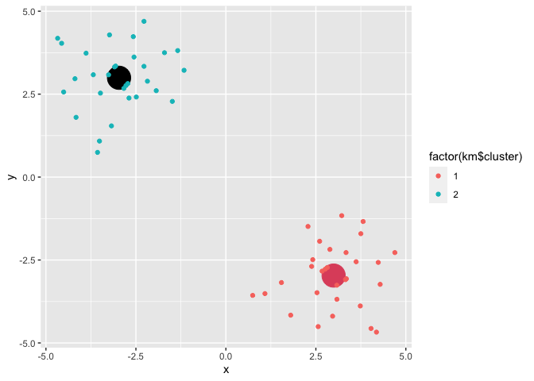

class 07 - machine learning 1
================
jack olmstead

In this class, we will explore different clustering methods and end with
PCA!

# k-means clustering

First we will make up some fake data to cluster a known set of values

``` r
hist(rnorm(10000), )
```


I want a vector with numbers from two distributions concatenated into
one

``` r
tmp <- c(
  rnorm(30, -3),
  rnorm(30, +3)
)
hist(tmp)
```


``` r
x <- data.frame(x = tmp, y = rev(tmp))
```

Let’s plot our points using ggplot2!

``` r
library(ggplot2)

ggplot(x) +
  aes(x=x, y=y) +
  geom_point()
```


First use of k-means

``` r
km <- kmeans(x, 2)
km
```

    K-means clustering with 2 clusters of sizes 30, 30

    Cluster means:
              x         y
    1  2.993310 -2.969012
    2 -2.969012  2.993310

    Clustering vector:
     [1] 2 2 2 2 2 2 2 2 2 2 2 2 2 2 2 2 2 2 2 2 2 2 2 2 2 2 2 2 2 2 1 1 1 1 1 1 1 1
    [39] 1 1 1 1 1 1 1 1 1 1 1 1 1 1 1 1 1 1 1 1 1 1

    Within cluster sum of squares by cluster:
    [1] 51.74184 51.74184
     (between_SS / total_SS =  91.2 %)

    Available components:

    [1] "cluster"      "centers"      "totss"        "withinss"     "tot.withinss"
    [6] "betweenss"    "size"         "iter"         "ifault"      

It’s important to be able to get back our computation in a way that is
intuitive

> Q. How about cluster centers?

> Q. How about the main result - the cluster assignment vectors?

> Q. Can we make a summary figure displaying the results? - The points
> colored by cluster assignment and maybe add the cluster centers as a
> different color?

``` r
p <- ggplot(x) +
  aes(x=x, y=y, color=factor(km$cluster)) +
  geom_point()
```

``` r
ggplot(NULL) +
  aes(x, y, color=factor(km$cluster)) +
  geom_point(data=data.frame(km$centers), color=factor(c(2,1)), size=10) +
  geom_point(data=x)
```



Above is a plot with us only asking kmeans for 2 clusters. Let’s try to
visualize how it performs when we ask it to perform clustering with a
range of clusters

``` r
totss <- NULL

for(k in 1:7) {
  curr_k <- kmeans(x, k)
  totss[k] <- curr_k$withinss
}
```

    Warning in totss[k] <- curr_k$withinss: number of items to replace is not a
    multiple of replacement length

    Warning in totss[k] <- curr_k$withinss: number of items to replace is not a
    multiple of replacement length

    Warning in totss[k] <- curr_k$withinss: number of items to replace is not a
    multiple of replacement length

    Warning in totss[k] <- curr_k$withinss: number of items to replace is not a
    multiple of replacement length

    Warning in totss[k] <- curr_k$withinss: number of items to replace is not a
    multiple of replacement length

    Warning in totss[k] <- curr_k$withinss: number of items to replace is not a
    multiple of replacement length

``` r
plot(totss, type='b', col='blue', lwd=3)
```


# hierarchical clustering

We can’t just give the `hclust()` function of input data `x` like we did
for `kmeans()`.

We need to first calculate a “distance (dissimilarity) matrix”. The
`dist()` function by default will calculate using Euclidean distance.

``` r
d <- dist(x)
hc <- hclust(d)
hc
```


    Call:
    hclust(d = d)

    Cluster method   : complete 
    Distance         : euclidean 
    Number of objects: 60 

The printout of `hclust()` isn’t very useful, but the plot method is
useful.

``` r
plot(hc)
abline(h=10, lty=2, col="red", lwd=3)
```


To get my all-important cluster membership vector out of an `hclust`
object, I can use the `cutree()` function.

``` r
hc_groups <- cutree(hc, h=10)
```

You can also cut the tree so it yields 3 groups.

``` r
hc_groups <- cutree(hc, k=2)
```

Let’s make another figure

``` r
ggplot(x) +
  aes(x=x, y=y, color=factor(hc_groups)) + 
  geom_point()
```


# pca

The main base R function to do PCR is called `prcomp()`

First, I need to import the data!

``` r
url <- "https://tinyurl.com/UK-foods"
foods <- read.csv(url, row.names=1)

head(foods)
```

                   England Wales Scotland N.Ireland
    Cheese             105   103      103        66
    Carcass_meat       245   227      242       267
    Other_meat         685   803      750       586
    Fish               147   160      122        93
    Fats_and_oils      193   235      184       209
    Sugars             156   175      147       139

Let’s explore the data graphically

``` r
barplot(as.matrix(x), beside=T, col=rainbow(nrow(x)))
```


``` r
barplot(as.matrix(x), beside=F, col=rainbow(nrow(x)))
```


Let’s try doing pairwise scatter plots of data for each country

``` r
pairs(foods, col=rainbow(10), pch=16)
```


How about we try PCA?

``` r
pca <- prcomp( t(foods) )
summary(pca)
```

    Importance of components:
                                PC1      PC2      PC3       PC4
    Standard deviation     324.1502 212.7478 73.87622 4.189e-14
    Proportion of Variance   0.6744   0.2905  0.03503 0.000e+00
    Cumulative Proportion    0.6744   0.9650  1.00000 1.000e+00

``` r
plot(pca)
```


``` r
pca$x
```

                     PC1         PC2         PC3           PC4
    England   -144.99315    2.532999 -105.768945  2.842865e-14
    Wales     -240.52915  224.646925   56.475555  7.804382e-13
    Scotland   -91.86934 -286.081786   44.415495 -9.614462e-13
    N.Ireland  477.39164   58.901862    4.877895  1.448078e-13

Let’s make a “score” or “ordination” plot

``` r
my_colors = c("orange", "red", "blue", "darkgreen")
plot(pca$x[,1], pca$x[,2], col=my_colors, pch=16)
# text(pca$x[,1], pca$x[,2], colnames(foods), col=my_colors)
abline(h=0, col="gray", lty=2)
abline(v=0, col="gray", lty=2)
```


``` r
pca_df <- as.data.frame(pca$x)
ggplot(pca_df) +
  aes(PC1, PC2) +
  geom_point()
```


How can we check to see the contribution of the original variables to
the PCs?

``` r
loadings <- as.data.frame(pca$rotation)
ggplot(loadings) +
  aes(PC1, rownames(loadings)) +
  geom_col() +
  labs(title='Loadings for PC1')
```


``` r
loadings <- as.data.frame(pca$rotation)
ggplot(loadings) +
  aes(PC2, rownames(loadings)) +
  geom_col() +
  labs(title="Loadings for PC2")
```


