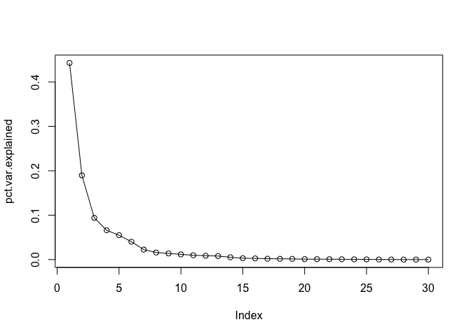
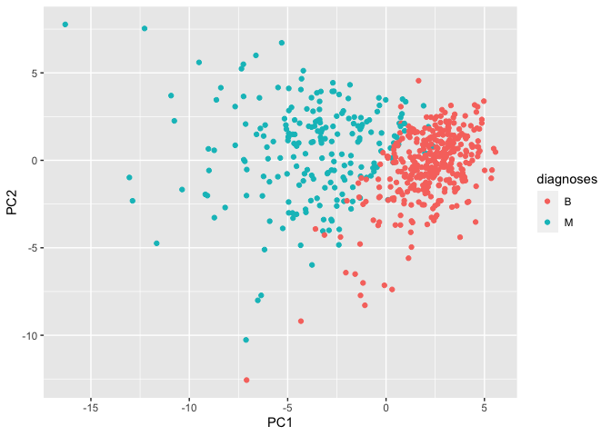
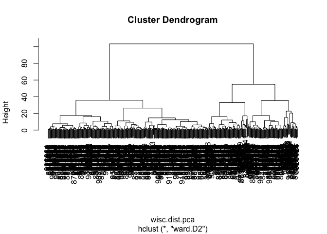
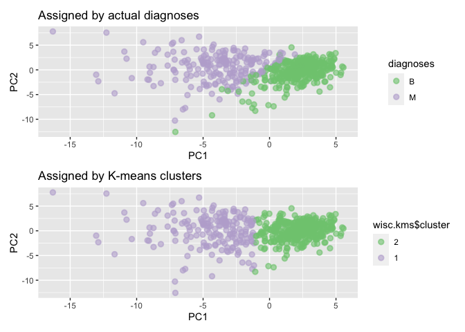

class 08 - unsupervised learning miniproject
================
jack olmstead

Let’s import the data first!

``` r
# Save your input data file into your Project directory
fna.data <- "WisconsinCancer.csv"

# Complete the following code to input the data and store as wisc.df
wisc.df <- read.csv(fna.data, row.names=1)
```

``` r
# head(wisc.df)
str(wisc.df)
```

    'data.frame':   569 obs. of  31 variables:
     $ diagnosis              : chr  "M" "M" "M" "M" ...
     $ radius_mean            : num  18 20.6 19.7 11.4 20.3 ...
     $ texture_mean           : num  10.4 17.8 21.2 20.4 14.3 ...
     $ perimeter_mean         : num  122.8 132.9 130 77.6 135.1 ...
     $ area_mean              : num  1001 1326 1203 386 1297 ...
     $ smoothness_mean        : num  0.1184 0.0847 0.1096 0.1425 0.1003 ...
     $ compactness_mean       : num  0.2776 0.0786 0.1599 0.2839 0.1328 ...
     $ concavity_mean         : num  0.3001 0.0869 0.1974 0.2414 0.198 ...
     $ concave.points_mean    : num  0.1471 0.0702 0.1279 0.1052 0.1043 ...
     $ symmetry_mean          : num  0.242 0.181 0.207 0.26 0.181 ...
     $ fractal_dimension_mean : num  0.0787 0.0567 0.06 0.0974 0.0588 ...
     $ radius_se              : num  1.095 0.543 0.746 0.496 0.757 ...
     $ texture_se             : num  0.905 0.734 0.787 1.156 0.781 ...
     $ perimeter_se           : num  8.59 3.4 4.58 3.44 5.44 ...
     $ area_se                : num  153.4 74.1 94 27.2 94.4 ...
     $ smoothness_se          : num  0.0064 0.00522 0.00615 0.00911 0.01149 ...
     $ compactness_se         : num  0.049 0.0131 0.0401 0.0746 0.0246 ...
     $ concavity_se           : num  0.0537 0.0186 0.0383 0.0566 0.0569 ...
     $ concave.points_se      : num  0.0159 0.0134 0.0206 0.0187 0.0188 ...
     $ symmetry_se            : num  0.03 0.0139 0.0225 0.0596 0.0176 ...
     $ fractal_dimension_se   : num  0.00619 0.00353 0.00457 0.00921 0.00511 ...
     $ radius_worst           : num  25.4 25 23.6 14.9 22.5 ...
     $ texture_worst          : num  17.3 23.4 25.5 26.5 16.7 ...
     $ perimeter_worst        : num  184.6 158.8 152.5 98.9 152.2 ...
     $ area_worst             : num  2019 1956 1709 568 1575 ...
     $ smoothness_worst       : num  0.162 0.124 0.144 0.21 0.137 ...
     $ compactness_worst      : num  0.666 0.187 0.424 0.866 0.205 ...
     $ concavity_worst        : num  0.712 0.242 0.45 0.687 0.4 ...
     $ concave.points_worst   : num  0.265 0.186 0.243 0.258 0.163 ...
     $ symmetry_worst         : num  0.46 0.275 0.361 0.664 0.236 ...
     $ fractal_dimension_worst: num  0.1189 0.089 0.0876 0.173 0.0768 ...

Let’s remove the first row - diagnosis - because this is the thing we
will be trying to predict.

``` r
wisc.data <- wisc.df[,-1]
diagnoses <- wisc.df[,1]
```

> Q1. How many observations are in this dataset?

``` r
sprintf("There are %i rows in this dataset", nrow(wisc.data))
```

    [1] "There are 569 rows in this dataset"

> Q2. How many of the observations have a malignant diagnosis?

``` r
sprintf("There are %s malignant diagnoses", sum(diagnoses == "M"))
```

    [1] "There are 212 malignant diagnoses"

``` r
sprintf("There are %s benign diagnoses", sum(diagnoses == "B"))
```

    [1] "There are 357 benign diagnoses"

``` r
table(diagnoses)
```

    diagnoses
      B   M 
    357 212 

> Q3. How many variables/features in the data are suffixed with \_mean?

``` r
sufx_mean <- grep("*_mean", colnames(wisc.data), value=T)
num_sufx_mean = length(sufx_mean)
sprintf("There are %i features that end with the suffix '_mean'", num_sufx_mean)
```

    [1] "There are 10 features that end with the suffix '_mean'"

> Q.What features are ’\_mean’ features?

``` r
sufx_mean
```

     [1] "radius_mean"            "texture_mean"           "perimeter_mean"        
     [4] "area_mean"              "smoothness_mean"        "compactness_mean"      
     [7] "concavity_mean"         "concave.points_mean"    "symmetry_mean"         
    [10] "fractal_dimension_mean"

Now, let’s start exploring our data. Before doing dimensionality
reduction, it is important to check if the data need to be scaled.
Recall two common reasons for scaling data include:

- The input variables use different units of measurement.
- The input variables have significantly different variances.

``` r
avgs <- colMeans(wisc.data)
SDs <- as.data.frame(round(apply(wisc.data, 2, sd), 2))
SDs$names <- rownames(SDs)
colnames(SDs) <- c("sd", "feature")

library(ggplot2)

ggplot(SDs) +
  aes(x=feature, y=sd) +
  geom_col() +
  coord_flip()
```


### PCA

``` r
wisc_pca <- prcomp(wisc.data, scale=T)
summary(wisc_pca)
```

    Importance of components:
                              PC1    PC2     PC3     PC4     PC5     PC6     PC7
    Standard deviation     3.6444 2.3857 1.67867 1.40735 1.28403 1.09880 0.82172
    Proportion of Variance 0.4427 0.1897 0.09393 0.06602 0.05496 0.04025 0.02251
    Cumulative Proportion  0.4427 0.6324 0.72636 0.79239 0.84734 0.88759 0.91010
                               PC8    PC9    PC10   PC11    PC12    PC13    PC14
    Standard deviation     0.69037 0.6457 0.59219 0.5421 0.51104 0.49128 0.39624
    Proportion of Variance 0.01589 0.0139 0.01169 0.0098 0.00871 0.00805 0.00523
    Cumulative Proportion  0.92598 0.9399 0.95157 0.9614 0.97007 0.97812 0.98335
                              PC15    PC16    PC17    PC18    PC19    PC20   PC21
    Standard deviation     0.30681 0.28260 0.24372 0.22939 0.22244 0.17652 0.1731
    Proportion of Variance 0.00314 0.00266 0.00198 0.00175 0.00165 0.00104 0.0010
    Cumulative Proportion  0.98649 0.98915 0.99113 0.99288 0.99453 0.99557 0.9966
                              PC22    PC23   PC24    PC25    PC26    PC27    PC28
    Standard deviation     0.16565 0.15602 0.1344 0.12442 0.09043 0.08307 0.03987
    Proportion of Variance 0.00091 0.00081 0.0006 0.00052 0.00027 0.00023 0.00005
    Cumulative Proportion  0.99749 0.99830 0.9989 0.99942 0.99969 0.99992 0.99997
                              PC29    PC30
    Standard deviation     0.02736 0.01153
    Proportion of Variance 0.00002 0.00000
    Cumulative Proportion  1.00000 1.00000

Let’s make a scree plot!

``` r
pca.var <-  wisc_pca$sdev^2
# proportion of variance
pct.var.explained <- pca.var / sum(pca.var)

plot(pct.var.explained, typ="o")
```



> Q4. From your results, what proportion of the original variance is
> captured by the first principal components (PC1)?

44.3% of the variance is captured by PC1.

> Q5. How many principal components (PCs) are required to describe at
> least 70% of the original variance in the data?

Only 3 PCs are needed to capture \> 70% of the variance.

> Q6. How many principal components (PCs) are required to describe at
> least 90% of the original variance in the data?

6 PCs are needed to capture \> 90% of the variance.

Let’s make our main results figure from our PCA (a.k.a PC/ordination
plot)!

``` r
pcs <- as.data.frame(wisc_pca$x)
ggplot(pcs) +
  aes(x=PC1, y=PC2, color=diagnoses) +
  geom_point() 
```



> Q7. What stands out to you about this plot? Is it easy or difficult to
> understand? Why?

There is a tantalizing separation in PC space between malignant and
benign biopsies. This makes me think something like k-means clustering
could be a viable way to diagnose new biopsies.

### Clustering

First, let’s get a scaled version of our data.

``` r
wisc.data.scaled <- scale(wisc.data)
```

``` r
wisc.dist <- dist(wisc.data.scaled)
wisc.hclust <- hclust(wisc.dist)

wisc.hclust
```


    Call:
    hclust(d = wisc.dist)

    Cluster method   : complete 
    Distance         : euclidean 
    Number of objects: 569 

``` r
plot(wisc.hclust)
```


``` r
groups <- cutree(wisc.hclust, h=19)
table(groups)
```

    groups
      1   2   3   4 
    177   7 383   2 

This is not a very inspiring dendrogram using the scaled data. There is
no great separation of clusters.

Let’s get a cross-tabulation of the hclust groups and the actual
diagnoses to see how the clusters correlate to diagnoses

``` r
table(groups, diagnoses)
```

          diagnoses
    groups   B   M
         1  12 165
         2   2   5
         3 343  40
         4   0   2

What if we try hierarchical clustering in PC space? Let’s only use the
first 3 PCs, based on our scree plot.

``` r
wisc.data.pca <- wisc_pca$x[,1:3]
wisc.dist.pca <- dist(wisc.data.pca)
wisc.hclust.pca <- hclust(wisc.dist.pca, method="ward.D2")

plot(wisc.hclust.pca)
```



``` r
pca.hclust.groups <- cutree(wisc.hclust.pca, 2)
table(pca.hclust.groups, diagnoses)
```

                     diagnoses
    pca.hclust.groups   B   M
                    1  24 179
                    2 333  33

Let’s calculate accuracy based off of these h-clusters in PCA space

``` r
# accuracy is number of correct diagnoses divided by number of total diagnoses
pct.acc <- (179 + 333) / length(diagnoses) * 100
pct.acc
```

    [1] 89.98243

``` r
wisc.kms <- kmeans(as.matrix(pcs$PC1, pcs$PC2), 2)
wisc.kms$cluster <- factor(wisc.kms$cluster)

# re-level wisc.kms$cluster, because it comes up later when trying to color points
wisc.kms$cluster <- relevel(wisc.kms$cluster, 2)

p.diagnoses <- ggplot(pcs) +
  aes(x=PC1, y=PC2, color=diagnoses) +
  geom_point(size=2, alpha=0.6, stroke=1) +
  labs(title="Assigned by actual diagnoses") +
  scale_color_brewer(palette = "Accent")

p.kmeans <- ggplot(pcs) +
  aes(x=PC1, y=PC2, color=wisc.kms$cluster) +
  geom_point(size=2, alpha=0.6, stroke=1) +
  labs(title="Assigned by K-means clusters") +
    scale_color_brewer(palette = "Accent", direction=1)

library(patchwork)
p.diagnoses + p.kmeans + plot_layout(ncol=1)
```



Hmm… the k-means clustering looks okay, but the demarcation line between
clusters relies almost exclusively on PC1, and almost not at all on PC2.
