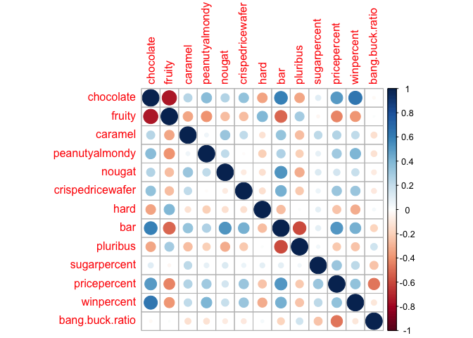

class 10 - candy
================
jack olmstead

``` r
url <- "https://raw.githubusercontent.com/fivethirtyeight/data/master/candy-power-ranking/candy-data.csv"
candy <- read.csv(url, row.names = 1)
```

> Q1. How many different candy types are in this dataset?

``` r
nrow(candy)
```

    [1] 85

> Q2. How many fruity candy types are in the dataset?

``` r
sum(candy$fruity)
```

    [1] 38

> Q3. What is your favorite candy in the dataset and what is it’s
> winpercent value?

For some cursed reason, the tasteless, unwashed FifeThirtyEight analysts
who put this frivilous exercise together didn’t include Hot Tamales in
the dataset. Probably because its win-rate was so game-breaking.

``` r
candy["Haribo Sour Bears",]$winpercent
```

    [1] 51.41243

> Q4. What is the winpercent value for “Kit Kat”?

``` r
candy["Kit Kat",]$winpercent
```

    [1] 76.7686

> Q5. What is the winpercent value for “Tootsie Roll Snack Bars”?

``` r
candy["Tootsie Roll Snack Bars",]$winpercent
```

    [1] 49.6535

``` r
library(skimr)
skim(candy)
```

|                                                  |       |
|:-------------------------------------------------|:------|
| Name                                             | candy |
| Number of rows                                   | 85    |
| Number of columns                                | 12    |
| \_\_\_\_\_\_\_\_\_\_\_\_\_\_\_\_\_\_\_\_\_\_\_   |       |
| Column type frequency:                           |       |
| numeric                                          | 12    |
| \_\_\_\_\_\_\_\_\_\_\_\_\_\_\_\_\_\_\_\_\_\_\_\_ |       |
| Group variables                                  | None  |

Data summary

**Variable type: numeric**

| skim_variable    | n_missing | complete_rate |  mean |    sd |    p0 |   p25 |   p50 |   p75 |  p100 | hist  |
|:-----------------|----------:|--------------:|------:|------:|------:|------:|------:|------:|------:|:------|
| chocolate        |         0 |             1 |  0.44 |  0.50 |  0.00 |  0.00 |  0.00 |  1.00 |  1.00 | ▇▁▁▁▆ |
| fruity           |         0 |             1 |  0.45 |  0.50 |  0.00 |  0.00 |  0.00 |  1.00 |  1.00 | ▇▁▁▁▆ |
| caramel          |         0 |             1 |  0.16 |  0.37 |  0.00 |  0.00 |  0.00 |  0.00 |  1.00 | ▇▁▁▁▂ |
| peanutyalmondy   |         0 |             1 |  0.16 |  0.37 |  0.00 |  0.00 |  0.00 |  0.00 |  1.00 | ▇▁▁▁▂ |
| nougat           |         0 |             1 |  0.08 |  0.28 |  0.00 |  0.00 |  0.00 |  0.00 |  1.00 | ▇▁▁▁▁ |
| crispedricewafer |         0 |             1 |  0.08 |  0.28 |  0.00 |  0.00 |  0.00 |  0.00 |  1.00 | ▇▁▁▁▁ |
| hard             |         0 |             1 |  0.18 |  0.38 |  0.00 |  0.00 |  0.00 |  0.00 |  1.00 | ▇▁▁▁▂ |
| bar              |         0 |             1 |  0.25 |  0.43 |  0.00 |  0.00 |  0.00 |  0.00 |  1.00 | ▇▁▁▁▂ |
| pluribus         |         0 |             1 |  0.52 |  0.50 |  0.00 |  0.00 |  1.00 |  1.00 |  1.00 | ▇▁▁▁▇ |
| sugarpercent     |         0 |             1 |  0.48 |  0.28 |  0.01 |  0.22 |  0.47 |  0.73 |  0.99 | ▇▇▇▇▆ |
| pricepercent     |         0 |             1 |  0.47 |  0.29 |  0.01 |  0.26 |  0.47 |  0.65 |  0.98 | ▇▇▇▇▆ |
| winpercent       |         0 |             1 | 50.32 | 14.71 | 22.45 | 39.14 | 47.83 | 59.86 | 84.18 | ▃▇▆▅▂ |

> Q6. Is there any variable/column that looks to be on a different scale
> to the majority of the other columns in the dataset?

Win percent definite has a different scale than everything else.

``` r
library(tidyverse)
```

    ── Attaching packages ─────────────────────────────────────── tidyverse 1.3.2 ──
    ✔ ggplot2 3.4.0     ✔ purrr   1.0.1
    ✔ tibble  3.1.8     ✔ dplyr   1.1.0
    ✔ tidyr   1.3.0     ✔ stringr 1.5.0
    ✔ readr   2.1.3     ✔ forcats 1.0.0
    ── Conflicts ────────────────────────────────────────── tidyverse_conflicts() ──
    ✖ dplyr::filter() masks stats::filter()
    ✖ dplyr::lag()    masks stats::lag()

``` r
candy$name <- rownames(candy)
neat <- gather(candy, "var", "value", -name)

ggplot(neat) +
  aes(x=name, y=value) +
  geom_col() +
  facet_wrap(~var)
```


> Q7. What do you think a zero and one represent for the
> candy\$chocolate column?

- 1: the candy is chocolate.
- 0: the candy is not chocolate.

> Q8. Plot a histogram of winpercent values

``` r
ggplot(candy) +
  aes(x=winpercent) +
  geom_histogram()
```

    `stat_bin()` using `bins = 30`. Pick better value with `binwidth`.


> Q9. Is the distribution of winpercent values symmetrical?

Looks to be long-tailed on the right side.

> Q10. Is the center of the distribution above or below 50%?

``` r
median(candy$winpercent)
```

    [1] 47.82975

> Q11. On average is chocolate candy higher or lower ranked than fruit
> candy?

Definitely a chocolate bias

``` r
ggplot(candy) +
  aes(x=winpercent, fill=factor(chocolate)) +
  geom_histogram(position="dodge2")
```

    `stat_bin()` using `bins = 30`. Pick better value with `binwidth`.


> Q.12. Is this difference statistically significant?

Very.

``` r
t.test(
  candy[candy$chocolate == 1,]$winpercent, 
  candy[candy$chocolate == 0,]$winpercent
  )
```


        Welch Two Sample t-test

    data:  candy[candy$chocolate == 1, ]$winpercent and candy[candy$chocolate == 0, ]$winpercent
    t = 7.3031, df = 67.539, p-value = 4.164e-10
    alternative hypothesis: true difference in means is not equal to 0
    95 percent confidence interval:
     13.64744 23.91110
    sample estimates:
    mean of x mean of y 
     60.92153  42.14226 

> Q13. What are the five least liked candy types in this set?

``` r
sorter <- sort(candy$winpercent, index.return=1, decreasing = T)
candy.sorted <- candy[sorter$ix,]
tail(candy.sorted)
```

                       chocolate fruity caramel peanutyalmondy nougat
    Root Beer Barrels          0      0       0              0      0
    Jawbusters                 0      1       0              0      0
    Super Bubble               0      1       0              0      0
    Chiclets                   0      1       0              0      0
    Boston Baked Beans         0      0       0              1      0
    Nik L Nip                  0      1       0              0      0
                       crispedricewafer hard bar pluribus sugarpercent pricepercent
    Root Beer Barrels                 0    1   0        1        0.732        0.069
    Jawbusters                        0    1   0        1        0.093        0.511
    Super Bubble                      0    0   0        0        0.162        0.116
    Chiclets                          0    0   0        1        0.046        0.325
    Boston Baked Beans                0    0   0        1        0.313        0.511
    Nik L Nip                         0    0   0        1        0.197        0.976
                       winpercent               name
    Root Beer Barrels    29.70369  Root Beer Barrels
    Jawbusters           28.12744         Jawbusters
    Super Bubble         27.30386       Super Bubble
    Chiclets             24.52499           Chiclets
    Boston Baked Beans   23.41782 Boston Baked Beans
    Nik L Nip            22.44534          Nik L Nip

> Q14. What are the top 5 all time favorite candy types out of this set?

``` r
head(candy.sorted)
```

                              chocolate fruity caramel peanutyalmondy nougat
    Reese's Peanut Butter cup         1      0       0              1      0
    Reese's Miniatures                1      0       0              1      0
    Twix                              1      0       1              0      0
    Kit Kat                           1      0       0              0      0
    Snickers                          1      0       1              1      1
    Reese's pieces                    1      0       0              1      0
                              crispedricewafer hard bar pluribus sugarpercent
    Reese's Peanut Butter cup                0    0   0        0        0.720
    Reese's Miniatures                       0    0   0        0        0.034
    Twix                                     1    0   1        0        0.546
    Kit Kat                                  1    0   1        0        0.313
    Snickers                                 0    0   1        0        0.546
    Reese's pieces                           0    0   0        1        0.406
                              pricepercent winpercent                      name
    Reese's Peanut Butter cup        0.651   84.18029 Reese's Peanut Butter cup
    Reese's Miniatures               0.279   81.86626        Reese's Miniatures
    Twix                             0.906   81.64291                      Twix
    Kit Kat                          0.511   76.76860                   Kit Kat
    Snickers                         0.651   76.67378                  Snickers
    Reese's pieces                   0.651   73.43499            Reese's pieces

> Q15. Make a first barplot of candy ranking based on winpercent values.

``` r
ggplot(candy.sorted) +
  aes(x=winpercent, y=rownames(candy.sorted)) +
  geom_col()
```


> Q16. This is quite ugly, use the reorder() function to get the bars
> sorted by winpercent?

``` r
ggplot(candy.sorted) +
  aes(x=winpercent, y=reorder(rownames(candy.sorted), winpercent)) +
  geom_col()
```


Let’s make some useful color vectors!

``` r
my.colors <- rep("black", nrow(candy))
my.colors[as.logical(candy$chocolate)] = "chocolate"
my.colors[as.logical(candy$bar)] = "brown"
my.colors[as.logical(candy$fruity)] = "pink"
```

``` r
ggplot(candy.sorted) +
  aes(x=winpercent, y=reorder(rownames(candy.sorted), winpercent)) +
  geom_col(fill=my.colors)
```


> Q17. What is the worst ranked chocolate candy?

Nik L Nip, whatever that is.

> Q18. What is the best ranked fruity candy?

Snickers, apparently? Although I don’t think of this as a fruity candy.

``` r
library("ggrepel")

ggplot(candy) +
  aes(winpercent, pricepercent, label=rownames(candy)) +
  geom_point(col=my.colors) +
  geom_text_repel(col=my.colors, size=3.3, max.overlaps = 5)
```

> Q19. Which candy type is the highest ranked in terms of winpercent for
> the least money - i.e. offers the most bang for your buck?

``` r
candy$bang.buck.ratio <- candy$winpercent / candy$pricepercent

ggplot(candy) +
  aes(x=bang.buck.ratio, y=reorder(rownames(candy), bang.buck.ratio)) +
  geom_col()
```


> Q20. What are the top 5 most expensive candy types in the dataset and
> of these which is the least popular?

``` r
candy.sort.indicies.price <- sort(candy$pricepercent, decreasing = T, index.return=T)
head(candy[candy.sort.indicies.price$ix, ])
```

                             chocolate fruity caramel peanutyalmondy nougat
    Nik L Nip                        0      1       0              0      0
    Nestle Smarties                  1      0       0              0      0
    Ring pop                         0      1       0              0      0
    Hershey's Krackel                1      0       0              0      0
    Hershey's Milk Chocolate         1      0       0              0      0
    Hershey's Special Dark           1      0       0              0      0
                             crispedricewafer hard bar pluribus sugarpercent
    Nik L Nip                               0    0   0        1        0.197
    Nestle Smarties                         0    0   0        1        0.267
    Ring pop                                0    1   0        0        0.732
    Hershey's Krackel                       1    0   1        0        0.430
    Hershey's Milk Chocolate                0    0   1        0        0.430
    Hershey's Special Dark                  0    0   1        0        0.430
                             pricepercent winpercent                     name
    Nik L Nip                       0.976   22.44534                Nik L Nip
    Nestle Smarties                 0.976   37.88719          Nestle Smarties
    Ring pop                        0.965   35.29076                 Ring pop
    Hershey's Krackel               0.918   62.28448        Hershey's Krackel
    Hershey's Milk Chocolate        0.918   56.49050 Hershey's Milk Chocolate
    Hershey's Special Dark          0.918   59.23612   Hershey's Special Dark
                             bang.buck.ratio
    Nik L Nip                       22.99728
    Nestle Smarties                 38.81884
    Ring pop                        36.57073
    Hershey's Krackel               67.84802
    Hershey's Milk Chocolate        61.53649
    Hershey's Special Dark          64.52737

## exploring the dimensionality of these data

``` r
library(corrplot)
```

    corrplot 0.92 loaded

``` r
cij <- cor(candy[, -13])
corrplot(cij)
```



``` r
pcs <- prcomp(candy[,-13], scale=T)
summary(pcs)
```

    Importance of components:
                              PC1    PC2     PC3    PC4     PC5     PC6     PC7
    Standard deviation     2.0938 1.2127 1.13054 1.0787 0.98027 0.93656 0.81530
    Proportion of Variance 0.3372 0.1131 0.09832 0.0895 0.07392 0.06747 0.05113
    Cumulative Proportion  0.3372 0.4503 0.54866 0.6382 0.71208 0.77956 0.83069
                               PC8     PC9    PC10    PC11    PC12    PC13
    Standard deviation     0.78462 0.68466 0.66328 0.57829 0.43128 0.39534
    Proportion of Variance 0.04736 0.03606 0.03384 0.02572 0.01431 0.01202
    Cumulative Proportion  0.87804 0.91410 0.94794 0.97367 0.98798 1.00000

Plot PCs

``` r
plot(pcs$x[,1], pcs$x[,2], col=my.colors, pch=16)
```


Add these PC coordinates to our candy data.

``` r
candy <- cbind(candy, pcs$x[, 1:3])
```

``` r
p <- ggplot(candy) +
  aes(x=PC1, y=PC2, 
      size=winpercent/100,
      color=my.colors) +
  geom_point()
p
```


Last, let’s look at the loadings of our stuffs.

``` r
par(mar=c(8,4,2,2))

barplot(pcs$rotation[,1], las=2, ylab="PC1 Contribution")
```


``` r
barplot(pcs$rotation[,2], las=2, ylab="PC2 Contribution")
```


``` r
# library(patchwork)
# p1+p2
```

> Q24. What original variables are picked up strongly by PC1 in the
> positive direction? Do these make sense to you?

Fruity, hard, pluribus, and bang-buck ratio positively drive PC1 scores.
Everything else negatively drives PC1 scores. Interesting, there aren’t
any variables that are *not* correlated with this PC.
