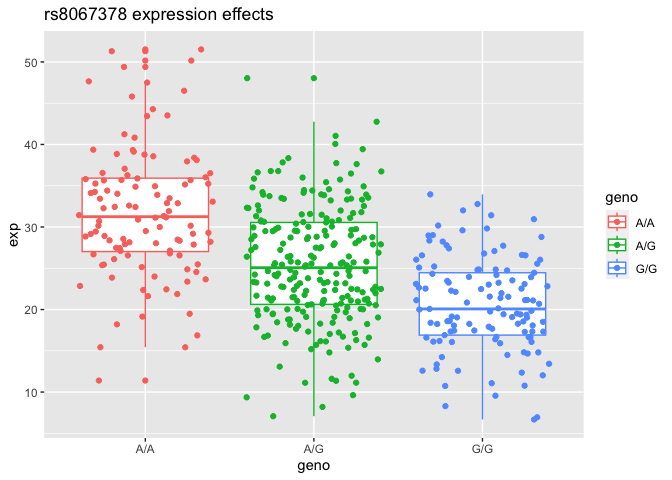

class 11 - genome informatics
================
jack olmstead

``` r
asthma <- read.csv("snp.csv")
length(which(asthma$Genotype..forward.strand. == "G|G")) / nrow(asthma)
```

    [1] 0.140625

``` r
# import pop data
link <- "https://bioboot.github.io/bggn213_W19/class-material/rs8067378_ENSG00000172057.6.txt"
pop <- read.csv(url(link), sep=" ")
head(pop)
```

       sample geno      exp
    1 HG00367  A/G 28.96038
    2 NA20768  A/G 20.24449
    3 HG00361  A/A 31.32628
    4 HG00135  A/A 34.11169
    5 NA18870  G/G 18.25141
    6 NA11993  A/A 32.89721

``` r
unique(pop$geno)
```

    [1] "A/G" "A/A" "G/G"

> Q13: Read this file into R and determine the sample size for each
> genotype and their corresponding median expression levels for each of
> these genotypes.  

``` r
library(tidyverse)

ag <- pop %>% filter(geno == "A/G")
aa <- pop %>% filter(geno=="A/A")
gg <- pop %>% filter(geno=="G/G")
```

``` r
median(ag$exp)
```

    [1] 25.06486

``` r
median(aa$exp)
```

    [1] 31.24847

``` r
median(gg$exp)
```

    [1] 20.07363

``` r
p <- ggplot(pop) +
  aes(x=geno, y=exp, color=geno) +
  geom_boxplot() +
  labs(
    title="rs8067378 expression effects",
    xlab="Allele",
    ylab="ORMDL3 RPKM"
  )

# p+ geom_density()
p + geom_point(position="jitter")
```


