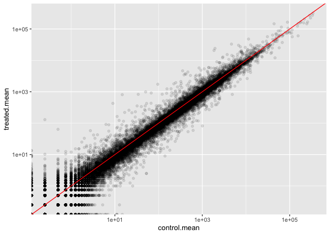
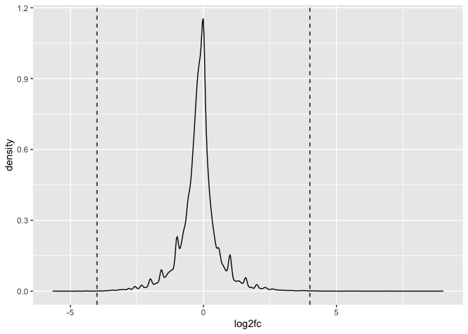
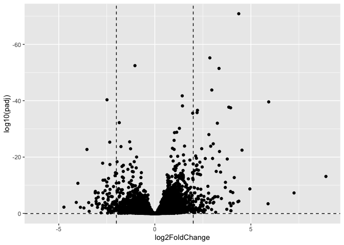
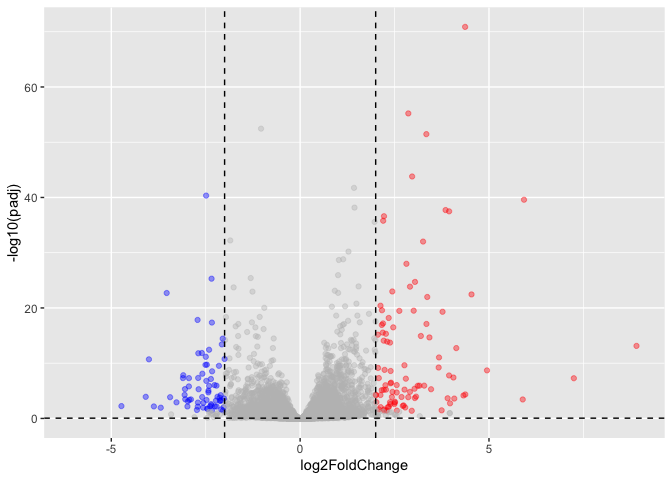
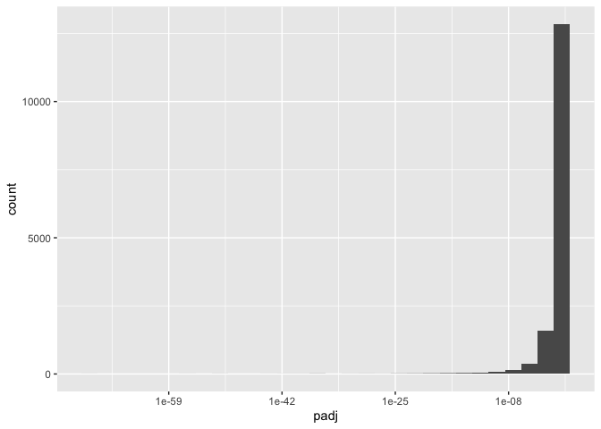
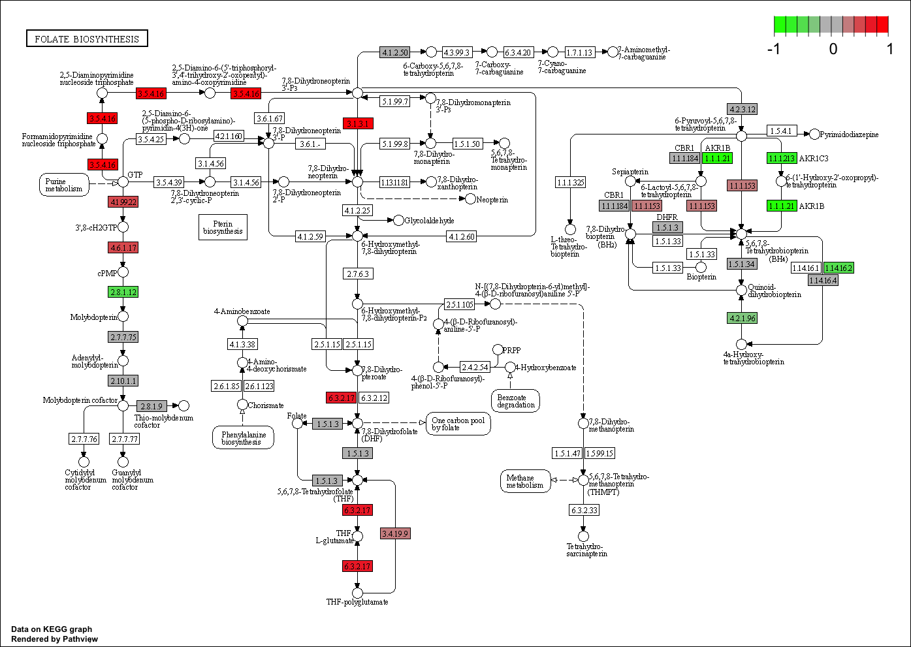

class 12 - transcriptomics
================
jack olmstead

In today’s class, we will be working with published, bulk RNA-seq data
from an experiment where airway smooth-muscle cells were treated with
dexamethasome, a synthetic gluococorticoid commonly used to treat asthma
(Himes et al. 2014)

``` r
library("DESeq2")
```

## Group counts

``` r
counts <- read.csv("airway_scaledcounts.csv", row.names = 1)
meta <- read.csv("airway_metadata.csv")

head(counts)
```

                    SRR1039508 SRR1039509 SRR1039512 SRR1039513 SRR1039516
    ENSG00000000003        723        486        904        445       1170
    ENSG00000000005          0          0          0          0          0
    ENSG00000000419        467        523        616        371        582
    ENSG00000000457        347        258        364        237        318
    ENSG00000000460         96         81         73         66        118
    ENSG00000000938          0          0          1          0          2
                    SRR1039517 SRR1039520 SRR1039521
    ENSG00000000003       1097        806        604
    ENSG00000000005          0          0          0
    ENSG00000000419        781        417        509
    ENSG00000000457        447        330        324
    ENSG00000000460         94        102         74
    ENSG00000000938          0          0          0

``` r
head(meta)
```

              id     dex celltype     geo_id
    1 SRR1039508 control   N61311 GSM1275862
    2 SRR1039509 treated   N61311 GSM1275863
    3 SRR1039512 control  N052611 GSM1275866
    4 SRR1039513 treated  N052611 GSM1275867
    5 SRR1039516 control  N080611 GSM1275870
    6 SRR1039517 treated  N080611 GSM1275871

First, we need to check that the metadata match the order of our samples

``` r
if( !all(meta$id == colnames(counts)) ) {
  warning("the metadata and count column names don't match up!")
}
```

> Q1. How many genes are in this dataset?

``` r
nrow(counts)
```

    [1] 38694

> Q2. How many ‘control’ cell lines do we have?

``` r
length(grep("control", meta$dex))
```

    [1] 4

Let’s start with some simple differential expression analysis

``` r
library(dplyr)
```

``` r
control <- meta %>% filter(dex=="control")
control.counts <- counts %>% select(control$id)
control.mean <- rowMeans(control.counts)
head(control.mean)
```

    ENSG00000000003 ENSG00000000005 ENSG00000000419 ENSG00000000457 ENSG00000000460 
             900.75            0.00          520.50          339.75           97.25 
    ENSG00000000938 
               0.75 

> Q3. How would you make the above code in either approach more robust?

Using rowMeans like I did here, instead of rowSums, like the code in the
lab guide, makes the code much more robust to sample additions or
subtractions from either group.

> Q4. Follow the same procedure for the treated samples (i.e. calculate
> the mean per gene across drug treated samples and assign to a labeled
> vector called treated.mean)

``` r
treated <- meta %>% filter(dex=="treated")
treated.counts <- counts %>% select(treated$id)
treated.mean <- rowMeans(treated.counts)
head(treated.mean)
```

    ENSG00000000003 ENSG00000000005 ENSG00000000419 ENSG00000000457 ENSG00000000460 
             658.00            0.00          546.00          316.50           78.75 
    ENSG00000000938 
               0.00 

To keep us organized, let’s make a new data.frame called `meancounts`
with our control and treated means

``` r
meancounts <- data.frame(control.mean, treated.mean)
head(meancounts)
```

                    control.mean treated.mean
    ENSG00000000003       900.75       658.00
    ENSG00000000005         0.00         0.00
    ENSG00000000419       520.50       546.00
    ENSG00000000457       339.75       316.50
    ENSG00000000460        97.25        78.75
    ENSG00000000938         0.75         0.00

> Q5 (a). Create a scatter plot showing the mean of the treated samples
> against the mean of the control samples.

``` r
plot(control.mean, treated.mean)
```


> Q5 (b). You could also use the ggplot2 package to make this figure
> producing the plot below

``` r
library(ggplot2)

p <- ggplot(meancounts) +
  aes(x=control.mean, y=treated.mean) +
  geom_point(alpha=0.1) +
  scale_x_log10() +
  scale_y_log10()
p + geom_abline(color="red")
```

    Warning: Transformation introduced infinite values in continuous x-axis

    Warning: Transformation introduced infinite values in continuous y-axis



> Q6. Try plotting both axes on a log scale. What is the argument to
> plot() that allows you to do this?

``` r
plot(control.mean, treated.mean, log="xy")
```

    Warning in xy.coords(x, y, xlabel, ylabel, log): 15032 x values <= 0 omitted
    from logarithmic plot

    Warning in xy.coords(x, y, xlabel, ylabel, log): 15281 y values <= 0 omitted
    from logarithmic plot


Let’s calculate log2 FC for our gene list.

``` r
meancounts$log2fc <- log2(meancounts$treated.mean / meancounts$control.mean)
```

Before we move on, we should get rid of gene rows that have any 0
values, because they will mess up our log2-FC values

``` r
to.keep <- rowSums(meancounts[,1:2] == 0) == 0
mycounts <- meancounts[to.keep,]
nrow(mycounts)
```

    [1] 21817

``` r
# zero.vals <- which(meancounts[,1:2]==0, arr.ind=TRUE)
# 
# to.rm <- unique(zero.vals[,1])
# mycounts <- meancounts[-to.rm,]
# head(mycounts)
```

> Q7. What is the purpose of the arr.ind argument in the which()
> function call above? Why would we then take the first column of the
> output and need to call the unique() function?

The arr.ind argument returns a matrix of the same size as the input,
which allows us to assess for unique values among rows.

> Q8. Using the up.ind vector above can you determine how many up
> regulated genes we have at the greater than 2 fc level?

> Q9. Using the down.ind vector above can you determine how many down
> regulated genes we have at the greater than 2 fc level?

``` r
up <- sum(mycounts$log2fc >= 2)
down <- sum(mycounts$log2fc <= -2) 

sprintf("Upregulated: %i      Downregulated: %i", up, down)
```

    [1] "Upregulated: 314      Downregulated: 485"

> Q10. Do you trust these results? Why or why not?

I don’t trust these results, because they’re comparing means between two
groups without accounting for variability within-group. I.e., there is
no statistical test!

``` r
p2 <- ggplot(meancounts) +
  aes(log2fc) +
  geom_density()
p2 + geom_vline(xintercept = c(-4, 4), linetype=2)
```

    Warning: Removed 16877 rows containing non-finite values (`stat_density()`).



## DESeq2

``` r
library("DESeq2")
```

Like most Bioconductor packages, DESeq wants its input in a very
particular format

``` r
dds <- DESeqDataSetFromMatrix(countData = counts,
                              colData = meta, 
                              design = ~dex)
```

    converting counts to integer mode

    Warning in DESeqDataSet(se, design = design, ignoreRank): some variables in
    design formula are characters, converting to factors

``` r
dds <- DESeq(dds)
```

    estimating size factors

    estimating dispersions

    gene-wise dispersion estimates

    mean-dispersion relationship

    final dispersion estimates

    fitting model and testing

``` r
res <- as.data.frame(results(dds))
head(res)
```

                       baseMean log2FoldChange     lfcSE       stat     pvalue
    ENSG00000000003 747.1941954    -0.35070302 0.1682457 -2.0844697 0.03711747
    ENSG00000000005   0.0000000             NA        NA         NA         NA
    ENSG00000000419 520.1341601     0.20610777 0.1010592  2.0394752 0.04140263
    ENSG00000000457 322.6648439     0.02452695 0.1451451  0.1689823 0.86581056
    ENSG00000000460  87.6826252    -0.14714205 0.2570073 -0.5725210 0.56696907
    ENSG00000000938   0.3191666    -1.73228897 3.4936010 -0.4958463 0.62000288
                         padj
    ENSG00000000003 0.1630348
    ENSG00000000005        NA
    ENSG00000000419 0.1760317
    ENSG00000000457 0.9616942
    ENSG00000000460 0.8158486
    ENSG00000000938        NA

## Volcano plot

Let’s make a main summary figure for our DESeq analysis

``` r
p <- ggplot(as.data.frame(res)) +
  aes(x=log2FoldChange, y=log10(padj)) +
  geom_point() +
  scale_y_reverse()

p <- p + geom_hline(yintercept=0.05, linetype=2) + geom_vline(xintercept=c(-2, 2), linetype=2)
p
```

    Warning: Removed 23549 rows containing missing values (`geom_point()`).



Let’s make a color vector and a gene-symbol vector to spice up the
volcano plot!

``` r
my.colors <- rep("grey", nrow(res))
my.colors[res$log2FoldChange >= 2 & res$padj < 0.05] <- "red"
my.colors[res$log2FoldChange <= -2 & res$padj < 0.05] <- "blue"

# my.labels <- rep("", nrow(res))
# my.labels[ res$log2FoldChange >= 2 | res$log2FoldChange <= -2 & res$padj < 0.05 ] <- 
#   rownames(res[ res$log2FoldChange >= 2 | res$log2FoldChange <= -2 & res$padj < 0.05 ])
```

``` r
p <- ggplot(as.data.frame(res)) +
  aes(x=log2FoldChange, y=-log10(padj)) +
  geom_point(color=my.colors, alpha=0.4)

p + geom_hline(yintercept=0.05, linetype=2) + geom_vline(xintercept=c(-2, 2), linetype=2)
```

    Warning: Removed 23549 rows containing missing values (`geom_point()`).



``` r
ggplot(as.data.frame(res)) +
  aes(padj) +
  geom_histogram() +
  scale_x_log10()
```

    `stat_bin()` using `bins = 30`. Pick better value with `binwidth`.

    Warning: Removed 23549 rows containing non-finite values (`stat_bin()`).



## Annotation transcripts

``` r
library("AnnotationDbi")
```


    Attaching package: 'AnnotationDbi'

    The following object is masked from 'package:dplyr':

        select

``` r
library("org.Hs.eg.db")
```

``` r
columns(org.Hs.eg.db)
```

     [1] "ACCNUM"       "ALIAS"        "ENSEMBL"      "ENSEMBLPROT"  "ENSEMBLTRANS"
     [6] "ENTREZID"     "ENZYME"       "EVIDENCE"     "EVIDENCEALL"  "GENENAME"    
    [11] "GENETYPE"     "GO"           "GOALL"        "IPI"          "MAP"         
    [16] "OMIM"         "ONTOLOGY"     "ONTOLOGYALL"  "PATH"         "PFAM"        
    [21] "PMID"         "PROSITE"      "REFSEQ"       "SYMBOL"       "UCSCKG"      
    [26] "UNIPROT"     

``` r
res$symbol <- mapIds(org.Hs.eg.db,
                     keys = rownames(res), # our current gene names
                     keytype = "ENSEMBL", # current format
                     column = "SYMBOL", # destination format
                     multiVals = "first" # do we want to collapse information from multiple transcripts into 1 symbol?
                     )
```

    'select()' returned 1:many mapping between keys and columns

> Q11. Run the mapIds() function two more times to add the Entrez ID and
> UniProt accession and GENENAME as new columns called

``` r
translate <- function(fmt) {
  mapIds(org.Hs.eg.db,
         keys = rownames(res), # our current gene names
         keytype = "ENSEMBL", # current format
         column = fmt, # destination format
         multiVals = "first" # do we want to collapse information from multiple transcripts into 1 symbol?
         )
}
```

``` r
res$entrez <- translate("ENTREZID")
```

    'select()' returned 1:many mapping between keys and columns

``` r
res$uniprot <- translate("UNIPROT")
```

    'select()' returned 1:many mapping between keys and columns

``` r
res$genename <- translate("GENENAME")
```

    'select()' returned 1:many mapping between keys and columns

## Save results for now

``` r
write.csv(res, file="results_annotated.csv")
```

## Pathway analysis

``` r
head(res)
```

                       baseMean log2FoldChange     lfcSE       stat     pvalue
    ENSG00000000003 747.1941954    -0.35070302 0.1682457 -2.0844697 0.03711747
    ENSG00000000005   0.0000000             NA        NA         NA         NA
    ENSG00000000419 520.1341601     0.20610777 0.1010592  2.0394752 0.04140263
    ENSG00000000457 322.6648439     0.02452695 0.1451451  0.1689823 0.86581056
    ENSG00000000460  87.6826252    -0.14714205 0.2570073 -0.5725210 0.56696907
    ENSG00000000938   0.3191666    -1.73228897 3.4936010 -0.4958463 0.62000288
                         padj   symbol entrez    uniprot
    ENSG00000000003 0.1630348   TSPAN6   7105 A0A024RCI0
    ENSG00000000005        NA     TNMD  64102     Q9H2S6
    ENSG00000000419 0.1760317     DPM1   8813     O60762
    ENSG00000000457 0.9616942    SCYL3  57147     Q8IZE3
    ENSG00000000460 0.8158486 C1orf112  55732 A0A024R922
    ENSG00000000938        NA      FGR   2268     P09769
                                                                       genename
    ENSG00000000003                                               tetraspanin 6
    ENSG00000000005                                                 tenomodulin
    ENSG00000000419 dolichyl-phosphate mannosyltransferase subunit 1, catalytic
    ENSG00000000457                                    SCY1 like pseudokinase 3
    ENSG00000000460                         chromosome 1 open reading frame 112
    ENSG00000000938              FGR proto-oncogene, Src family tyrosine kinase

``` r
fc <- res$log2FoldChange
names(fc) <- res$entrez
```

``` r
library(gage)
library(gageData)
library(pathview)
```

``` r
data(kegg.gs)

gs <- gage(fc, gsets=kegg.gs)
```

Let’s check out our output object

``` r
attributes(gs)
```

    $names
    [1] "greater" "less"    "stats"  

``` r
head(gs$greater)
```

                                               p.geomean stat.mean       p.val
    hsa00500 Starch and sucrose metabolism   0.003306262  2.772644 0.003306262
    hsa00330 Arginine and proline metabolism 0.012317455  2.280002 0.012317455
    hsa04910 Insulin signaling pathway       0.017110962  2.129511 0.017110962
    hsa04510 Focal adhesion                  0.025239833  1.961955 0.025239833
    hsa04920 Adipocytokine signaling pathway 0.043426078  1.725063 0.043426078
    hsa00790 Folate biosynthesis             0.048254489  1.744387 0.048254489
                                                 q.val set.size        exp1
    hsa00500 Starch and sucrose metabolism   0.5422269       52 0.003306262
    hsa00330 Arginine and proline metabolism 0.7319651       54 0.012317455
    hsa04910 Insulin signaling pathway       0.7319651      138 0.017110962
    hsa04510 Focal adhesion                  0.7319651      200 0.025239833
    hsa04920 Adipocytokine signaling pathway 0.7319651       68 0.043426078
    hsa00790 Folate biosynthesis             0.7319651       11 0.048254489

``` r
pathview(gene.data = fc, pathway.id = "hsa00790")
```

    'select()' returned 1:1 mapping between keys and columns

    Info: Working in directory /Users/jack/Library/CloudStorage/OneDrive-UCSanDiego/213/bggn213_github/class12

    Info: Writing image file hsa00790.pathview.png


