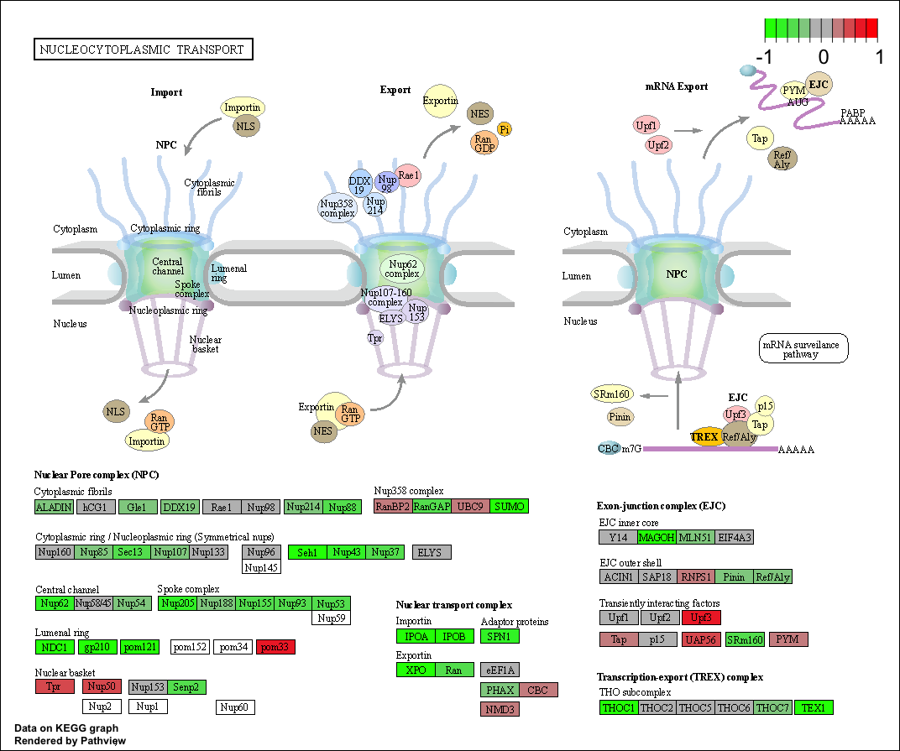
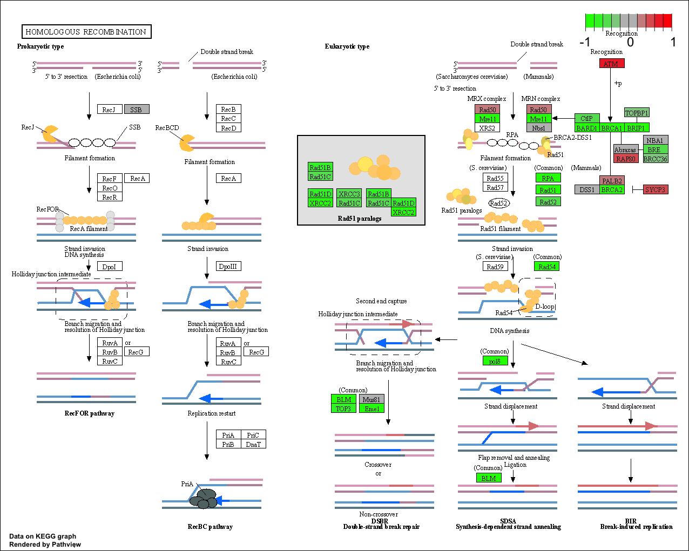
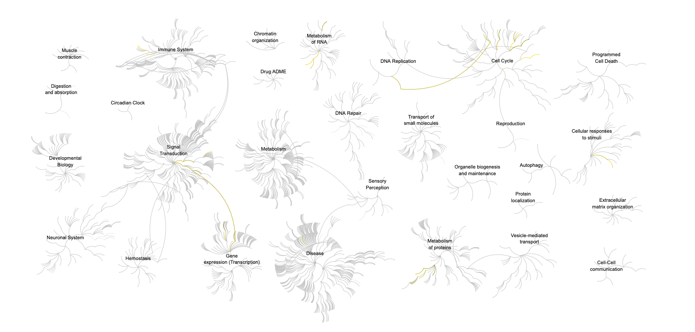

class 13 - functional annotation
================
jack olmstead

# Read in countData and colData

``` r
countData <- read.csv("GSE37704_featurecounts.csv", row.names = 1)
colData <- read.csv("GSE37704_metadata.csv", row.names = 1)
```

Do the row names of meta match the columns of countData?

``` r
all( 
    rownames(colData) == colnames(countData) 
    )
```

    Warning in rownames(colData) == colnames(countData): longer object length is
    not a multiple of shorter object length

    [1] FALSE

> Q. Complete the code to remove the troublesome first column from
> countData

The numrows and numcols are different between meta and countData. This
is because countData’s first column is not a sample name, but instead
referring to the length of the transcript. Let’s remove it.

``` r
countData <- countData[-1]
all( 
    rownames(colData) == colnames(countData) 
    )
```

    [1] TRUE

``` r
library(dplyr)
library(ggplot2)
```

> Q. Complete the code below to filter countData to exclude genes
> (i.e. rows) where we have 0 read count across all samples
> (i.e. columns).

``` r
clean.counts <- countData %>% filter_all(
  any_vars(
    . != 0
  )
)

nrow(clean.counts)
```

    [1] 15975

# PCA as quality control

``` r
pcs <- prcomp(t(clean.counts), scale=T)
plot(pcs)
```


``` r
summary(pcs)
```

    Importance of components:
                               PC1     PC2      PC3      PC4      PC5       PC6
    Standard deviation     87.7211 73.3196 32.89604 31.15094 29.18417 6.648e-13
    Proportion of Variance  0.4817  0.3365  0.06774  0.06074  0.05332 0.000e+00
    Cumulative Proportion   0.4817  0.8182  0.88594  0.94668  1.00000 1.000e+00

> How much variance is captured by the first two PCs?

About `81.8%` variance captured in the first two components. pretty
good.

Let’s plot samples in PCA space

``` r
ggplot(as.data.frame(pcs$x)) +
  aes(x=PC1, y=PC2, col=colData$condition) +
  geom_point(size = 5)
```


# DESeq analysis

``` r
library(DESeq2)
```

``` r
dds <- DESeqDataSetFromMatrix(countData = clean.counts,
                              colData = colData, 
                              design = ~condition)
```

    Warning in DESeqDataSet(se, design = design, ignoreRank): some variables in
    design formula are characters, converting to factors

``` r
dds <- DESeq(dds)
```

    estimating size factors

    estimating dispersions

    gene-wise dispersion estimates

    mean-dispersion relationship

    final dispersion estimates

    fitting model and testing

``` r
res <- as.data.frame(results(dds))

head(res)
```

                      baseMean log2FoldChange      lfcSE        stat       pvalue
    ENSG00000279457   29.91358     0.17925708 0.32482157   0.5518632 5.810421e-01
    ENSG00000187634  183.22965     0.42645712 0.14026582   3.0403495 2.363037e-03
    ENSG00000188976 1651.18808    -0.69272046 0.05484654 -12.6301576 1.439895e-36
    ENSG00000187961  209.63794     0.72975561 0.13185990   5.5343255 3.124282e-08
    ENSG00000187583   47.25512     0.04057653 0.27189281   0.1492372 8.813664e-01
    ENSG00000187642   11.97975     0.54281049 0.52155985   1.0407444 2.979942e-01
                            padj
    ENSG00000279457 6.865548e-01
    ENSG00000187634 5.157181e-03
    ENSG00000188976 1.765489e-35
    ENSG00000187961 1.134130e-07
    ENSG00000187583 9.190306e-01
    ENSG00000187642 4.033793e-01

> Q. Call the summary() function on your results to get a sense of how
> many genes are up or down-regulated at the default 0.1 p-value cutoff.

``` r
DESeq2::summary(res)
```

        baseMean        log2FoldChange          lfcSE              stat          
     Min.   :     0.1   Min.   :-4.902884   Min.   :0.03163   Min.   :-52.97126  
     1st Qu.:    12.1   1st Qu.:-0.459361   1st Qu.:0.07507   1st Qu.: -2.34434  
     Median :   214.8   Median : 0.008707   Median :0.13108   Median :  0.05028  
     Mean   :  1002.1   Mean   : 0.015164   Mean   :0.60432   Mean   : -0.08060  
     3rd Qu.:   774.3   3rd Qu.: 0.508047   3rd Qu.:0.53867   3rd Qu.:  2.22749  
     Max.   :399481.5   Max.   : 8.822085   Max.   :4.08047   Max.   : 48.42078  
                                                                                 
         pvalue             padj       
     Min.   :0.00000   Min.   :0.0000  
     1st Qu.:0.00000   1st Qu.:0.0000  
     Median :0.02204   Median :0.0163  
     Mean   :0.24012   Mean   :0.2300  
     3rd Qu.:0.47941   3rd Qu.:0.4411  
     Max.   :0.99997   Max.   :1.0000  
                       NA's   :1237    

> Q. Improve this plot by completing the below code, which adds color
> and axis labels

# Summary volcano plot

``` r
my.colors <- rep("gray", nrow(res))
my.colors[ res$log2FoldChange > 2 & res$padj < 0.05 ] <- "red"
my.colors[ res$log2FoldChange < -2 & res$padj < 0.05 ] <- "blue"

ggplot(as.data.frame(res)) +
  aes(x=log2FoldChange, y=-log10(padj)) +
  geom_point(color = my.colors, alpha = 0.4) +
  geom_hline(yintercept = 0.05) +
  geom_vline(xintercept = c(-2, 2)) +
  ylim(0, NA) + 
  labs(ylab = "-log10(Adjusted P-value)",
       xlab = "log2(Fold Change)"
       )
```

    Warning: Removed 1237 rows containing missing values (`geom_point()`).


# Add annotations

``` r
library(AnnotationDbi)
library("org.Hs.eg.db")

columns(org.Hs.eg.db)
```

     [1] "ACCNUM"       "ALIAS"        "ENSEMBL"      "ENSEMBLPROT"  "ENSEMBLTRANS"
     [6] "ENTREZID"     "ENZYME"       "EVIDENCE"     "EVIDENCEALL"  "GENENAME"    
    [11] "GENETYPE"     "GO"           "GOALL"        "IPI"          "MAP"         
    [16] "OMIM"         "ONTOLOGY"     "ONTOLOGYALL"  "PATH"         "PFAM"        
    [21] "PMID"         "PROSITE"      "REFSEQ"       "SYMBOL"       "UCSCKG"      
    [26] "UNIPROT"     

> Q. Use the mapIDs() function multiple times to add SYMBOL, ENTREZID
> and GENENAME annotation to our results by completing the code below.

``` r
res$symbol = mapIds(org.Hs.eg.db,
                    keys=row.names(res), 
                    keytype="ENSEMBL",
                    column="SYMBOL",
                    multiVals="first")
```

    'select()' returned 1:many mapping between keys and columns

``` r
res$entrez = mapIds(org.Hs.eg.db,
                    keys=row.names(res),
                    keytype="ENSEMBL",
                    column="ENTREZID",
                    multiVals="first")
```

    'select()' returned 1:many mapping between keys and columns

``` r
res$name =   mapIds(org.Hs.eg.db,
                    keys=row.names(res),
                    keytype="ENSEMBL",
                    column="GENENAME",
                    multiVals="first")
```

    'select()' returned 1:many mapping between keys and columns

``` r
head(res)
```

                      baseMean log2FoldChange      lfcSE        stat       pvalue
    ENSG00000279457   29.91358     0.17925708 0.32482157   0.5518632 5.810421e-01
    ENSG00000187634  183.22965     0.42645712 0.14026582   3.0403495 2.363037e-03
    ENSG00000188976 1651.18808    -0.69272046 0.05484654 -12.6301576 1.439895e-36
    ENSG00000187961  209.63794     0.72975561 0.13185990   5.5343255 3.124282e-08
    ENSG00000187583   47.25512     0.04057653 0.27189281   0.1492372 8.813664e-01
    ENSG00000187642   11.97975     0.54281049 0.52155985   1.0407444 2.979942e-01
                            padj  symbol entrez
    ENSG00000279457 6.865548e-01    <NA>   <NA>
    ENSG00000187634 5.157181e-03  SAMD11 148398
    ENSG00000188976 1.765489e-35   NOC2L  26155
    ENSG00000187961 1.134130e-07  KLHL17 339451
    ENSG00000187583 9.190306e-01 PLEKHN1  84069
    ENSG00000187642 4.033793e-01   PERM1  84808
                                                                        name
    ENSG00000279457                                                     <NA>
    ENSG00000187634                 sterile alpha motif domain containing 11
    ENSG00000188976 NOC2 like nucleolar associated transcriptional repressor
    ENSG00000187961                              kelch like family member 17
    ENSG00000187583                 pleckstrin homology domain containing N1
    ENSG00000187642             PPARGC1 and ESRR induced regulator, muscle 1

> Q. Finally for this section let’s reorder these results by adjusted
> p-value and save them to a CSV file in your current project directory.

``` r
res <- res[order(res$pvalue),]
write.csv(res, file = "deseq_results.csv")
```

# KEGG, GO

``` r
library(gage)
library(gageData)
library(pathview)
```

I need to create the input for `gage()` - a vector of fold-change values
with entrez IDs as the `names()`

``` r
fc <- res$log2FoldChange
names(fc) <- res$entrez
```

``` r
data(kegg.sets.hs)

kegg.res <- gage(fc, gsets=kegg.sets.hs)
head(kegg.res$less)
```

                                                      p.geomean stat.mean
    hsa04110 Cell cycle                            8.995727e-06 -4.378644
    hsa03030 DNA replication                       9.424076e-05 -3.951803
    hsa05130 Pathogenic Escherichia coli infection 1.405864e-04 -3.765330
    hsa03013 RNA transport                         1.375901e-03 -3.028500
    hsa03440 Homologous recombination              3.066756e-03 -2.852899
    hsa04114 Oocyte meiosis                        3.784520e-03 -2.698128
                                                          p.val       q.val
    hsa04110 Cell cycle                            8.995727e-06 0.001889103
    hsa03030 DNA replication                       9.424076e-05 0.009841047
    hsa05130 Pathogenic Escherichia coli infection 1.405864e-04 0.009841047
    hsa03013 RNA transport                         1.375901e-03 0.072234819
    hsa03440 Homologous recombination              3.066756e-03 0.128803765
    hsa04114 Oocyte meiosis                        3.784520e-03 0.132458191
                                                   set.size         exp1
    hsa04110 Cell cycle                                 121 8.995727e-06
    hsa03030 DNA replication                             36 9.424076e-05
    hsa05130 Pathogenic Escherichia coli infection       53 1.405864e-04
    hsa03013 RNA transport                              144 1.375901e-03
    hsa03440 Homologous recombination                    28 3.066756e-03
    hsa04114 Oocyte meiosis                             102 3.784520e-03

``` r
pathview(fc, pathway.id = "hsa04110")
```

    'select()' returned 1:1 mapping between keys and columns

    Info: Working in directory /Users/jack/Library/CloudStorage/OneDrive-UCSanDiego/213/bggn213_github/class13

    Info: Writing image file hsa04110.pathview.png

``` r
pathview(fc, pathway.id = "hsa04080")
```

    'select()' returned 1:1 mapping between keys and columns

    Info: Working in directory /Users/jack/Library/CloudStorage/OneDrive-UCSanDiego/213/bggn213_github/class13

    Info: Writing image file hsa04080.pathview.png

 

> Q. Can you do the same procedure as above to plot the pathview figures
> for the top 5 down-reguled pathways?

``` r
kegg.res.pathways <- rownames(kegg.res$less)[1:5]
kegg.res.ids = substr(kegg.res.pathways, start=1, stop=8)
kegg.res.ids
```

    [1] "hsa04110" "hsa03030" "hsa05130" "hsa03013" "hsa03440"

``` r
pathview(gene.data=fc, pathway.id=kegg.res.ids, species="hsa")
```

    'select()' returned 1:1 mapping between keys and columns

    Info: Working in directory /Users/jack/Library/CloudStorage/OneDrive-UCSanDiego/213/bggn213_github/class13

    Info: Writing image file hsa04110.pathview.png

    'select()' returned 1:1 mapping between keys and columns

    Info: Working in directory /Users/jack/Library/CloudStorage/OneDrive-UCSanDiego/213/bggn213_github/class13

    Info: Writing image file hsa03030.pathview.png

    'select()' returned 1:1 mapping between keys and columns

    Info: Working in directory /Users/jack/Library/CloudStorage/OneDrive-UCSanDiego/213/bggn213_github/class13

    Info: Writing image file hsa05130.pathview.png

    'select()' returned 1:1 mapping between keys and columns

    Info: Working in directory /Users/jack/Library/CloudStorage/OneDrive-UCSanDiego/213/bggn213_github/class13

    Info: Writing image file hsa03013.pathview.png

    'select()' returned 1:1 mapping between keys and columns

    Info: Working in directory /Users/jack/Library/CloudStorage/OneDrive-UCSanDiego/213/bggn213_github/class13

    Info: Writing image file hsa03440.pathview.png

 
 


``` r
data(go.sets.hs)
data(go.subs.hs)

go.bp.sets = go.sets.hs[go.subs.hs$BP]

go.bp.res = gage(fc, gsets=go.bp.sets, same.dir=TRUE)

head(go.bp.res$less)
```

                                                p.geomean stat.mean        p.val
    GO:0048285 organelle fission             1.536227e-15 -8.063910 1.536227e-15
    GO:0000280 nuclear division              4.286961e-15 -7.939217 4.286961e-15
    GO:0007067 mitosis                       4.286961e-15 -7.939217 4.286961e-15
    GO:0000087 M phase of mitotic cell cycle 1.169934e-14 -7.797496 1.169934e-14
    GO:0007059 chromosome segregation        2.028624e-11 -6.878340 2.028624e-11
    GO:0000236 mitotic prometaphase          1.729553e-10 -6.695966 1.729553e-10
                                                    q.val set.size         exp1
    GO:0048285 organelle fission             5.841698e-12      376 1.536227e-15
    GO:0000280 nuclear division              5.841698e-12      352 4.286961e-15
    GO:0007067 mitosis                       5.841698e-12      352 4.286961e-15
    GO:0000087 M phase of mitotic cell cycle 1.195672e-11      362 1.169934e-14
    GO:0007059 chromosome segregation        1.658603e-08      142 2.028624e-11
    GO:0000236 mitotic prometaphase          1.178402e-07       84 1.729553e-10

> Q. Can you do the same procedure as above to plot the pathview figures
> for the top 5 down-reguled pathways?

> Q: What pathway has the most significant “Entities p-value”? Do the
> most significant pathways listed match your previous KEGG results?
> What factors could cause differences between the two methods?

``` r
sig_genes <- res[res$padj <= 0.05 & !is.na(res$padj), "symbol"]
write.table(sig_genes, 
            file="significant_genes.txt", 
            row.names=FALSE, 
            col.names=FALSE, 
            quote=FALSE
            )
```

Exported to Reactome!



> Q: What pathway has the most significant “Entities p-value”? Do the
> most significant pathways listed match your previous KEGG results?
> What factors could cause differences between the two methods?

Endosomal/Vacuolar pathway. They do roughly match the 2nd hit in the
KEGG database: “Lysosome.” The reactome database gene lists could be
different from the KEGG gene lists, accounting for differences in
enrichment of biological processes from both approaches.
