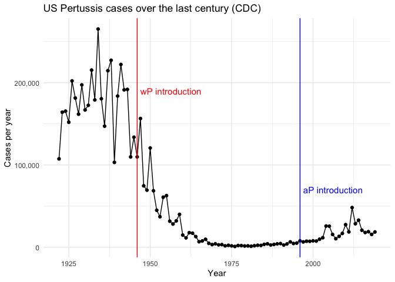
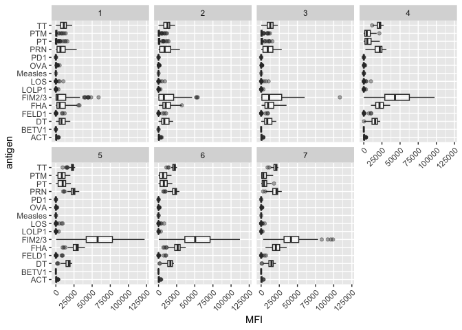
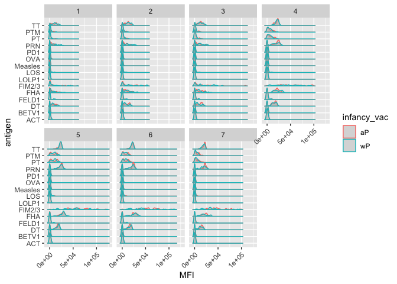
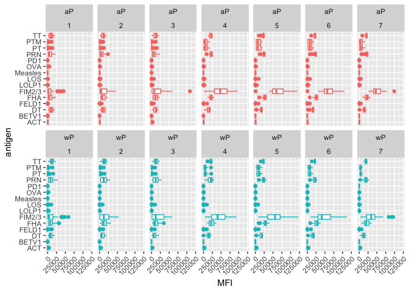
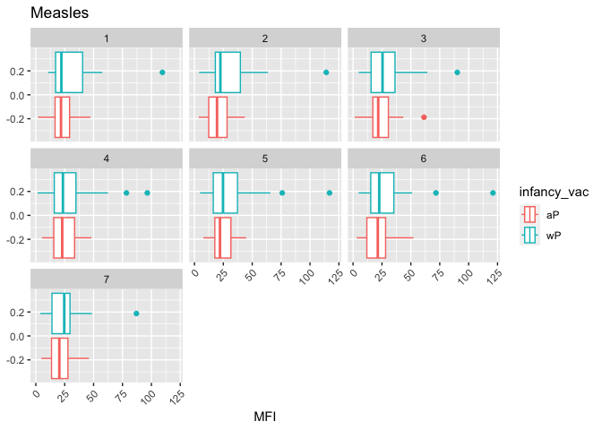
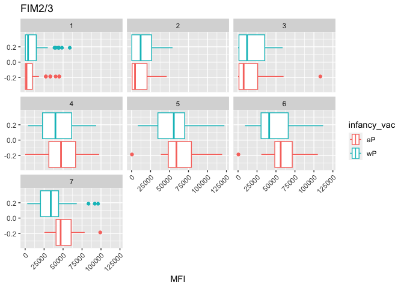
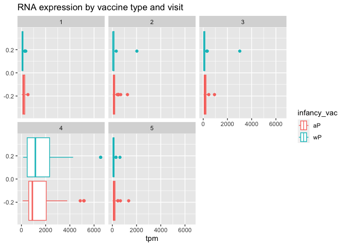
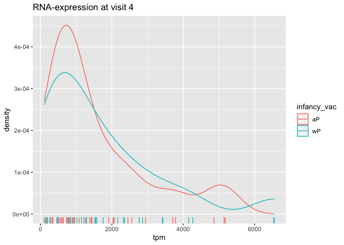

Pertussis resurgence mini-project
================
jack olmstead

# Web scraping

I will extract the Pertussis epi data from the CDC’s table using the
datapasta package.

- https://www.cdc.gov/pertussis/surv-reporting/cases-by-year.html

Let’s make a plot of the number of cases per year

``` r
library(ggplot2)
```

``` r
p <- ggplot(cdc) +
      aes(x=year,
          y=cases) +
      geom_line() +
      geom_point() +
      labs(x="Year",
           y="Cases per year",
           title="US Pertussis cases over the last century (CDC)") +
      scale_y_continuous(labels=scales::label_comma()) +
  theme_minimal()
```

The first Pertussis vaccine (whole-Pertussis, “wP”) was introduced in
1946. An updated, antigen vaccine (“aP”) was introduced in 1996, which
had fewer side-effects than the wP vaccine. Let’s add colored lines on
the plots to indicate the introductions of these vaccines.

``` r
p + geom_vline(xintercept = 1946, color="red") + # intro of wP vax
  geom_vline(xintercept = 1996, color="blue") + # intro of aP vax
  annotate("text", x=1947, y=190000, label="wP introduction", size=4, hjust=0, color="red") +
  annotate("text", x=1997, y=70000, label="aP introduction", size=4, hjust=0, color="blue")
```



Why is this vaccine-preventable disease on the upswing? To answer this
questions, we need information about the immunological mechanisms for
responses to the wP and aP vaccines. Luckily, the CMI-PB project
collects exactly these data from participants longitudinally to answer
this question.

# Exploring the CMI-PB data

We will use the `jsonlite` package to download CMI-PB data from their
API.

``` r
library(jsonlite)

subject <- read_json("https://www.cmi-pb.org/api/subject", simplifyVector = T)
head(subject)
```

      subject_id infancy_vac biological_sex              ethnicity  race
    1          1          wP         Female Not Hispanic or Latino White
    2          2          wP         Female Not Hispanic or Latino White
    3          3          wP         Female                Unknown White
    4          4          wP           Male Not Hispanic or Latino Asian
    5          5          wP           Male Not Hispanic or Latino Asian
    6          6          wP         Female Not Hispanic or Latino White
      year_of_birth date_of_boost      dataset
    1    1986-01-01    2016-09-12 2020_dataset
    2    1968-01-01    2019-01-28 2020_dataset
    3    1983-01-01    2016-10-10 2020_dataset
    4    1988-01-01    2016-08-29 2020_dataset
    5    1991-01-01    2016-08-29 2020_dataset
    6    1988-01-01    2016-10-10 2020_dataset

> Q4. How many wP and aP subjects are there?

``` r
table(subject$infancy_vac)
```


    aP wP 
    47 49 

> Q5. How many males and females are in the dataset?

``` r
table(subject$biological_sex)
```


    Female   Male 
        66     30 

> **Q6.** What is the breakdown of race and biological sex (e.g. number
> of Asian females, White males etc…)

``` r
table(subject$biological_sex, subject$race)
```

            
             American Indian/Alaska Native Asian Black or African American
      Female                             0    18                         2
      Male                               1     9                         0
            
             More Than One Race Native Hawaiian or Other Pacific Islander
      Female                  8                                         1
      Male                    2                                         1
            
             Unknown or Not Reported White
      Female                      10    27
      Male                         4    13

Read in the `specimen` table

``` r
specimen <- read_json("http://cmi-pb.org/api/specimen", simplifyVector = T)
head(specimen)
```

      specimen_id subject_id actual_day_relative_to_boost
    1           1          1                           -3
    2           2          1                          736
    3           3          1                            1
    4           4          1                            3
    5           5          1                            7
    6           6          1                           11
      planned_day_relative_to_boost specimen_type visit
    1                             0         Blood     1
    2                           736         Blood    10
    3                             1         Blood     2
    4                             3         Blood     3
    5                             7         Blood     4
    6                            14         Blood     5

To know whether a given `specimen_id` comes from an aP or wP individual
we need to link (a.k.a. “join” or merge) our `specimen` and `subject`
data frames. The excellent **dplyr** package (that we have used
previously) has a family of `join()` functions that can help us with
this common task:

> **Q9.** Complete the code to join `specimen` and `subject` tables to
> make a new merged data frame containing all specimen records along
> with their associated subject details:

``` r
library(dplyr)
```

``` r
meta <- inner_join(specimen, subject)
```

    Joining with `by = join_by(subject_id)`

``` r
dim(meta)
```

    [1] 729  13

``` r
head(meta)
```

      specimen_id subject_id actual_day_relative_to_boost
    1           1          1                           -3
    2           2          1                          736
    3           3          1                            1
    4           4          1                            3
    5           5          1                            7
    6           6          1                           11
      planned_day_relative_to_boost specimen_type visit infancy_vac biological_sex
    1                             0         Blood     1          wP         Female
    2                           736         Blood    10          wP         Female
    3                             1         Blood     2          wP         Female
    4                             3         Blood     3          wP         Female
    5                             7         Blood     4          wP         Female
    6                            14         Blood     5          wP         Female
                   ethnicity  race year_of_birth date_of_boost      dataset
    1 Not Hispanic or Latino White    1986-01-01    2016-09-12 2020_dataset
    2 Not Hispanic or Latino White    1986-01-01    2016-09-12 2020_dataset
    3 Not Hispanic or Latino White    1986-01-01    2016-09-12 2020_dataset
    4 Not Hispanic or Latino White    1986-01-01    2016-09-12 2020_dataset
    5 Not Hispanic or Latino White    1986-01-01    2016-09-12 2020_dataset
    6 Not Hispanic or Latino White    1986-01-01    2016-09-12 2020_dataset

# Analyzing IgG titers

> **Q10.** Now using the same procedure join `meta` with `titer` data so
> we can further analyze this data in terms of time of visit aP/wP,
> male/female etc

``` r
titer <- read_json("http://cmi-pb.org/api/ab_titer", simplifyVector = T)
head(titer)
```

      specimen_id isotype is_antigen_specific antigen        MFI MFI_normalised
    1           1     IgE               FALSE   Total 1110.21154       2.493425
    2           1     IgE               FALSE   Total 2708.91616       2.493425
    3           1     IgG                TRUE      PT   68.56614       3.736992
    4           1     IgG                TRUE     PRN  332.12718       2.602350
    5           1     IgG                TRUE     FHA 1887.12263      34.050956
    6           1     IgE                TRUE     ACT    0.10000       1.000000
       unit lower_limit_of_detection
    1 UG/ML                 2.096133
    2 IU/ML                29.170000
    3 IU/ML                 0.530000
    4 IU/ML                 6.205949
    5 IU/ML                 4.679535
    6 IU/ML                 2.816431

``` r
abdata <- inner_join(meta, titer)
```

    Joining with `by = join_by(specimen_id)`

    Warning in inner_join(meta, titer): Each row in `x` is expected to match at most 1 row in `y`.
    ℹ Row 1 of `x` matches multiple rows.
    ℹ If multiple matches are expected, set `multiple = "all"` to silence this
      warning.

``` r
dim(meta)
```

    [1] 729  13

``` r
head(meta)
```

      specimen_id subject_id actual_day_relative_to_boost
    1           1          1                           -3
    2           2          1                          736
    3           3          1                            1
    4           4          1                            3
    5           5          1                            7
    6           6          1                           11
      planned_day_relative_to_boost specimen_type visit infancy_vac biological_sex
    1                             0         Blood     1          wP         Female
    2                           736         Blood    10          wP         Female
    3                             1         Blood     2          wP         Female
    4                             3         Blood     3          wP         Female
    5                             7         Blood     4          wP         Female
    6                            14         Blood     5          wP         Female
                   ethnicity  race year_of_birth date_of_boost      dataset
    1 Not Hispanic or Latino White    1986-01-01    2016-09-12 2020_dataset
    2 Not Hispanic or Latino White    1986-01-01    2016-09-12 2020_dataset
    3 Not Hispanic or Latino White    1986-01-01    2016-09-12 2020_dataset
    4 Not Hispanic or Latino White    1986-01-01    2016-09-12 2020_dataset
    5 Not Hispanic or Latino White    1986-01-01    2016-09-12 2020_dataset
    6 Not Hispanic or Latino White    1986-01-01    2016-09-12 2020_dataset

> **Q11.** How many specimens (i.e. entries in `abdata`) do we have for
> each `isotype`?

``` r
table(abdata$isotype)
```


     IgE  IgG IgG1 IgG2 IgG3 IgG4 
    6698 1413 6141 6141 6141 6141 

> **Q12.** What do you notice about the number of visit 8 specimens
> compared to other visits?

``` r
table(abdata$visit, abdata$isotype)
```

       
         IgE  IgG IgG1 IgG2 IgG3 IgG4
      1  986  405 1101 1101 1101 1101
      2  986  174  870  870  870  870
      3  986  174  870  870  870  870
      4  986  174  870  870  870  870
      5  986  174  870  870  870  870
      6  918  162  810  810  810  810
      7  833  147  735  735  735  735
      8   17    3   15   15   15   15

There are many fewer antibody specimens for visit 8.

> Q. How many different antigens are there?

``` r
length(unique(abdata$antigen))
```

    [1] 16

``` r
table(abdata$antigen)
```


        ACT   BETV1      DT   FELD1     FHA  FIM2/3   LOLP1     LOS Measles     OVA 
       1970    1970    2135    1970    2529    2135    1970    1970    1970    2135 
        PD1     PRN      PT     PTM   Total      TT 
       1970    2529    2529    1970     788    2135 

> **Q13.** Make a summary boxplot of Ab titer levels (MFI) for all
> antigens

``` r
ig1 <- abdata %>% filter(isotype == "IgG1", visit!=8)
head(ig1)
```

      specimen_id subject_id actual_day_relative_to_boost
    1           1          1                           -3
    2           1          1                           -3
    3           1          1                           -3
    4           1          1                           -3
    5           1          1                           -3
    6           1          1                           -3
      planned_day_relative_to_boost specimen_type visit infancy_vac biological_sex
    1                             0         Blood     1          wP         Female
    2                             0         Blood     1          wP         Female
    3                             0         Blood     1          wP         Female
    4                             0         Blood     1          wP         Female
    5                             0         Blood     1          wP         Female
    6                             0         Blood     1          wP         Female
                   ethnicity  race year_of_birth date_of_boost      dataset isotype
    1 Not Hispanic or Latino White    1986-01-01    2016-09-12 2020_dataset    IgG1
    2 Not Hispanic or Latino White    1986-01-01    2016-09-12 2020_dataset    IgG1
    3 Not Hispanic or Latino White    1986-01-01    2016-09-12 2020_dataset    IgG1
    4 Not Hispanic or Latino White    1986-01-01    2016-09-12 2020_dataset    IgG1
    5 Not Hispanic or Latino White    1986-01-01    2016-09-12 2020_dataset    IgG1
    6 Not Hispanic or Latino White    1986-01-01    2016-09-12 2020_dataset    IgG1
      is_antigen_specific antigen        MFI MFI_normalised  unit
    1                TRUE     ACT 274.355068      0.6928058 IU/ML
    2                TRUE     LOS  10.974026      2.1645083 IU/ML
    3                TRUE   FELD1   1.448796      0.8080941 IU/ML
    4                TRUE   BETV1   0.100000      1.0000000 IU/ML
    5                TRUE   LOLP1   0.100000      1.0000000 IU/ML
    6                TRUE Measles  36.277417      1.6638332 IU/ML
      lower_limit_of_detection
    1                 3.848750
    2                 4.357917
    3                 2.699944
    4                 1.734784
    5                 2.550606
    6                 4.438966

``` r
library(ggridges)
```

``` r
ggplot(ig1) +
  aes(MFI, antigen) +
  geom_boxplot(alpha=0.4) + 
  facet_wrap(vars(visit), nrow=2) +
  theme(
    axis.text.x = element_text(angle=45, hjust=1)
  )
```



> Q14. What antigens show differences in the level of IgG1 antibody
> titers recognizing them over time? Why these and not others?

The biggest responders are FIM2/3 and FHA, for the most part. PRN may
have some changes in reponse, but it could also very easily be
classified as noise.

``` r
ggplot(ig1) +
  aes(MFI, antigen, col=infancy_vac) +
  geom_density_ridges2(alpha=0.4) + 
  facet_wrap(vars(visit), nrow=2) +
  theme(
    axis.text.x = element_text(angle=45, hjust=1)
  )
```

    Picking joint bandwidth of 1050

    Picking joint bandwidth of 1400

    Picking joint bandwidth of 1480

    Picking joint bandwidth of 1740

    Picking joint bandwidth of 1610

    Picking joint bandwidth of 1510

    Picking joint bandwidth of 1350



``` r
ggplot(ig1) +
  aes(MFI, antigen, col=infancy_vac ) +
  geom_boxplot(show.legend = FALSE) + 
  facet_wrap(vars(infancy_vac, visit), nrow=2) +
  theme(
    axis.text.x = element_text(angle=45, hjust=1)
  )
```



Doesn’t seem to be a dramatic difference in humoral response by vaccine
type… there must be something else explaining our phenomenon!

> Q15. Filter to pull out only two specific antigens for analysis and
> create a boxplot for each. You can chose any you like. Below I picked
> a “control” antigen (“Measles”, that is not in our vaccines) and a
> clear antigen of interest (“FIM2/3”, extra-cellular fimbriae proteins
> from B. pertussis that participate in substrate attachment

``` r
filter(ig1, antigen=="Measles") %>%
  ggplot() +
  aes(MFI, col=infancy_vac) +
  geom_boxplot(show.legend = T) +
  facet_wrap(vars(visit)) +
  theme(
    axis.text.x = element_text(angle=45, hjust=1)
  ) +
  labs(title="Measles")
```



``` r
filter(ig1, antigen=="FIM2/3") %>%
  ggplot() +
  aes(MFI, col=infancy_vac) +
  geom_boxplot(show.legend = T) +
  facet_wrap(vars(visit)) +
  theme(
    axis.text.x = element_text(angle=45, hjust=1)
  ) +
  labs(title="FIM2/3")
```



# Obtaining CMI-PB RNASeq data

``` r
url <- "https://www.cmi-pb.org/api/v2/rnaseq?versioned_ensembl_gene_id=eq.ENSG00000211896.7"
rna <- read_json(url, simplifyVector = T)
head(rna)
```

      versioned_ensembl_gene_id specimen_id raw_count      tpm
    1         ENSG00000211896.7         344     18613  929.640
    2         ENSG00000211896.7         243      2011  112.584
    3         ENSG00000211896.7         261      2161  124.759
    4         ENSG00000211896.7         282      2428  138.292
    5         ENSG00000211896.7         345     51963 2946.136
    6         ENSG00000211896.7         244     49652 2356.749

Let’s join the RNA-seq data to our metadata

``` r
ssrna <- inner_join(rna, meta)
```

    Joining with `by = join_by(specimen_id)`

``` r
head(ssrna)
```

      versioned_ensembl_gene_id specimen_id raw_count      tpm subject_id
    1         ENSG00000211896.7         344     18613  929.640         44
    2         ENSG00000211896.7         243      2011  112.584         31
    3         ENSG00000211896.7         261      2161  124.759         33
    4         ENSG00000211896.7         282      2428  138.292         36
    5         ENSG00000211896.7         345     51963 2946.136         44
    6         ENSG00000211896.7         244     49652 2356.749         31
      actual_day_relative_to_boost planned_day_relative_to_boost specimen_type
    1                            3                             3         Blood
    2                            3                             3         Blood
    3                           15                            14         Blood
    4                            1                             1         Blood
    5                            7                             7         Blood
    6                            7                             7         Blood
      visit infancy_vac biological_sex              ethnicity               race
    1     3          aP         Female     Hispanic or Latino More Than One Race
    2     3          wP         Female Not Hispanic or Latino              Asian
    3     5          wP           Male     Hispanic or Latino More Than One Race
    4     2          aP         Female     Hispanic or Latino              White
    5     4          aP         Female     Hispanic or Latino More Than One Race
    6     4          wP         Female Not Hispanic or Latino              Asian
      year_of_birth date_of_boost      dataset
    1    1998-01-01    2016-11-07 2020_dataset
    2    1989-01-01    2016-09-26 2020_dataset
    3    1990-01-01    2016-10-10 2020_dataset
    4    1997-01-01    2016-10-24 2020_dataset
    5    1998-01-01    2016-11-07 2020_dataset
    6    1989-01-01    2016-09-26 2020_dataset

> Q18. Make a plot of the time course of gene expression for IGHG1 gene
> (i.e. a plot of visit vs. tpm

``` r
ggplot(ssrna) +
  aes(visit, tpm, group=subject_id) +
  geom_point() +
  geom_line(alpha=0.2)
```


> Q19. What do you notice about the expression of this gene?

Expression peaks for one visit and seems to fall back to normal.

> Q20. Does this pattern in time match the trend of antibody titer data?
> If not, why not?

It precedes the rise in IgG1 titer levels. This makes sense, considering
you need antibody transcription before protein expression. Pretty
remarkable how long the antibodies stick around though!

Let’s look at this by vaccine status.

``` r
ggplot(ssrna) +
  aes(tpm, col=infancy_vac) +
  geom_boxplot() +
  facet_wrap(vars(visit)) +
  labs(title="RNA expression by vaccine type and visit")
```



``` r
ssrna %>%  
  filter(visit==4) %>% 
  ggplot() +
    aes(tpm, col=infancy_vac) + geom_density() + 
    geom_rug() +
  labs(title="RNA-expression at visit 4")
```


