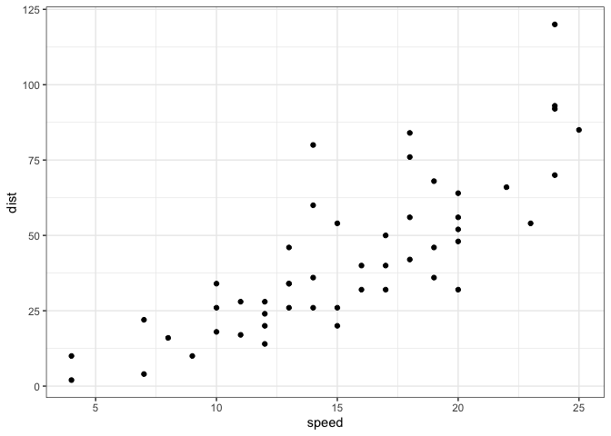

class 05 - data visualization
================
jack olmstead

# Plotting in R

R has many plotting systems, including ‘base’ R, which uses built-in
functions.

``` r
# stopping distance for certain speeds
head(cars)
```

      speed dist
    1     4    2
    2     4   10
    3     7    4
    4     7   22
    5     8   16
    6     9   10

``` r
plot(cars)
```


Base R plots are quick and convenient for basic plots. To use a non-base
package, I need to first install it using `install.packages("package")`
and then load it using `library(package)`

``` r
library(ggplot2)
ggplot(cars) 
```


All this does is print a blank canvas. ggplot requires more verbosity
than `plot`. Every ggplot requires at least 3 things:

- data (the data.frame with the stuff we want to plot)
- **aes**thetics or aes() for short (how the data map to the plot)
- **geom**etries or geom() for short (the plot type)

``` r
ggplot(cars) +
  aes(x=speed, y=dist)
```


This still doesn’t produce the plot we wanted… maybe because we haven’t
specified a geometry?

``` r
ggplot(cars) +
  aes(x=speed, y=dist) +
  geom_point() +
  theme_bw()
```



:)

``` r
ggplot(cars) +
  aes(x=speed, y=dist) +
  geom_point() +
  geom_line() +
  theme_bw()
```


This doesn’t look right… how about adding geom_smooth()?

``` r
ggplot(cars) +
  aes(x=speed, y=dist) +
  geom_point() +
  geom_smooth(method='lm', se=FALSE, linewidth=3, alpha=0.1) +
  theme_bw()
```

    `geom_smooth()` using formula = 'y ~ x'


## A plot of some gene expression data

``` r
# read in data
url <- "https://bioboot.github.io/bimm143_S20/class-material/up_down_expression.txt"
genes <- read.delim(url)
head(genes)
```

            Gene Condition1 Condition2      State
    1      A4GNT -3.6808610 -3.4401355 unchanging
    2       AAAS  4.5479580  4.3864126 unchanging
    3      AASDH  3.7190695  3.4787276 unchanging
    4       AATF  5.0784720  5.0151916 unchanging
    5       AATK  0.4711421  0.5598642 unchanging
    6 AB015752.4 -3.6808610 -3.5921390 unchanging

> Q. How many genes are in this dataset?

``` r
nrow(genes)
```

    [1] 5196

``` r
sprintf("There are %s genes in this dataset. Produced with sprintf.", nrow(genes))
```

    [1] "There are 5196 genes in this dataset. Produced with sprintf."

There are 5196 genes in this dataset. Produced with in-line code.

There are 4 columns in this dataset.

``` r
round (table(genes$State) / nrow(genes) * 100, 2)
```


          down unchanging         up 
          1.39      96.17       2.44 

### Let’s make a plot of this gene-expression data

``` r
ggplot(genes) +
  aes(x=Condition1, y=Condition2, color=State) +
  geom_point(alpha=0.4) +
  theme_bw()
```


I can save any ggplot in a variable for later use, so I don’t have to
re-type the whole damn thing.

``` r
p <- ggplot(genes) +
  aes(x=Condition1, y=Condition2, color=State) +
  geom_point(shape=21, alpha=0.5) +
  theme_bw()
p
```


``` r
p + 
  scale_color_manual(
  values=c("blue", "grey", "red")
) +
  labs(
    title='Gene expression changes following drug treatment'
  )
```


## Faceting with ggplot

Now we will use the “gapminder” dataset of human life expectancy across
the world to test different functions of ggplot.

``` r
url <- "https://raw.githubusercontent.com/jennybc/gapminder/master/inst/extdata/gapminder.tsv"

gapminder <- read.delim(url)
head(gapminder)
```

          country continent year lifeExp      pop gdpPercap
    1 Afghanistan      Asia 1952  28.801  8425333  779.4453
    2 Afghanistan      Asia 1957  30.332  9240934  820.8530
    3 Afghanistan      Asia 1962  31.997 10267083  853.1007
    4 Afghanistan      Asia 1967  34.020 11537966  836.1971
    5 Afghanistan      Asia 1972  36.088 13079460  739.9811
    6 Afghanistan      Asia 1977  38.438 14880372  786.1134

> Q. How many countries are in this dataset?

``` r
length(unique(gapminder$country)) # get the number of unique countries
```

    [1] 142

> Q. How many timepoints are in this dataset?

``` r
length(unique(gapminder$year))
```

    [1] 12

> Q. What country has the smallest population?

``` r
gapminder$country[gapminder$pop == min(gapminder$pop)]
```

    [1] "Sao Tome and Principe"

``` r
# or
gapminder$country[which.min(gapminder$pop)]
```

    [1] "Sao Tome and Principe"

> Q. What is the smallest population? What year does it occur?

``` r
# just get the whole damn thing
gapminder[which.min(gapminder$pop),]
```

                       country continent year lifeExp   pop gdpPercap
    1297 Sao Tome and Principe    Africa 1952  46.471 60011  879.5836

``` r
g <- ggplot(gapminder) +
  aes(x=gdpPercap, y=lifeExp, color=continent, size=pop) + 
  geom_point(alpha=0.4, stroke=0.75) +
  facet_wrap(~continent)
```

## gganimate

``` r
library(gganimate)
```

``` r
g + 
  labs(title="Year: {frame_time}", x="GDP per capita", y="Life expectancy") +
  transition_time(year) +
  shadow_wake(wake_length=0.01, alpha=FALSE)
```


